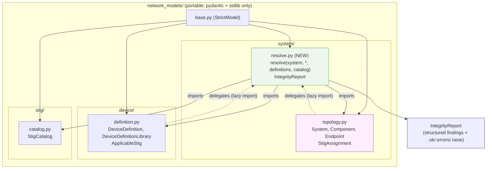
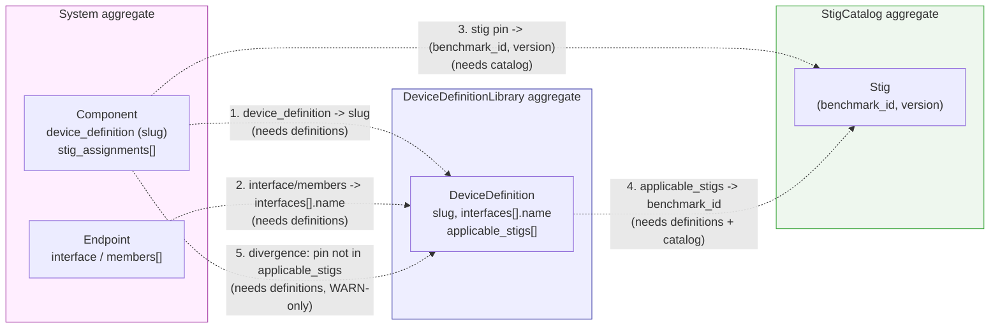
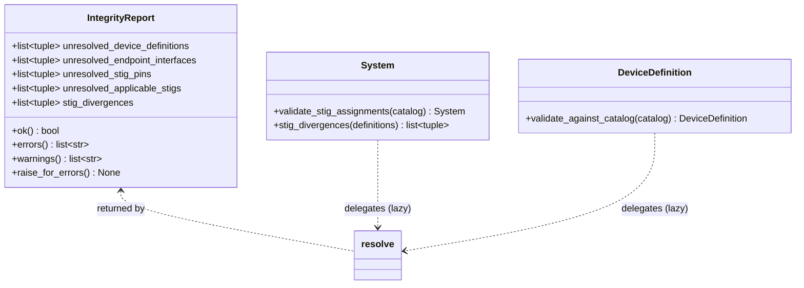

# Design Document: cross-aggregate-resolver

## Overview

Cross-aggregate reference resolution is currently **smeared across models**. Three
opt-in methods on two aggregates answer the same shape of question — "does this
reference resolve against another aggregate?":

- `System.validate_stig_assignments(catalog)` — raises on an unresolved pin.
- `System.stig_divergences(definitions)` — warn-only divergence report.
- `DeviceDefinition.validate_against_catalog(catalog)` — raises on an unresolved
  applicable STIG.

Worse, two referential edges resolve against **nothing at all**:

- `Component.device_definition` (a slug) is never checked against a
  `DeviceDefinitionLibrary`.
- `Endpoint.interface` (and each LAG `members` entry) is never checked against the
  component's device definition's actual interface names.

This design **deepens** a single module — `network_models/system/resolve.py` —
exposing one entry point:

```python
resolve(system, *, definitions: DeviceDefinitionLibrary | None = None,
        catalog: StigCatalog | None = None) -> IntegrityReport
```

`resolve(...)` runs every cross-aggregate check that its supplied aggregates can
support and returns a serializable, **non-raising** `IntegrityReport`. Each check
is **opt-in per aggregate**: a class of finding is produced only when the aggregate
it needs (`definitions` and/or `catalog`) is supplied; otherwise that finding list
is empty.

The three existing methods are **kept** (tests depend on them) but **reimplemented
to delegate** to the resolver's focused checks, so there is exactly **one**
implementation of each check — the essence of *locality*. Intra-aggregate
invariants (component→enclave, connection→component, switchport→VLAN) stay exactly
where they are, inside `System` model_validators; this spec is only about
**cross-aggregate** edges (System ↔ DeviceDefinitionLibrary ↔ StigCatalog).

Everything stays inside the portable package (Pydantic + stdlib only). The **seam**
is one-directional: `resolve.py` imports the models; the models import the resolver
only inside method bodies (or under `TYPE_CHECKING`), never at module load — keeping
the model core **acyclic** and partial drafts constructible standalone.

---

## Scope Boundary (read this first)

| Concern | In scope (this repo) | Out of scope | Rationale |
|---|---|---|---|
| `resolve(...)` + `IntegrityReport` | ✅ new `network_models/system/resolve.py` | — | The single cross-aggregate seam |
| `Component.device_definition` → library slug | ✅ new check | — | Edge resolved against nothing today |
| `Endpoint.interface`/`members` → definition interfaces | ✅ new check | — | Edge resolved against nothing today |
| STIG pin / applicable / divergence checks | ✅ moved into resolver | — | Subsume the three scattered methods |
| Three legacy methods | ✅ kept, delegate to resolver | — | Back-compat; one implementation |
| Intra-aggregate validators (enclave/component/VLAN) | ❌ untouched | ✅ stay in `System` | Same-aggregate; correctly placed |
| Making any check a `model_validator` | ❌ | ✅ deliberately opt-in | Partial drafts must construct |
| App-layer compliance / JMESPath / NaC | ❌ | ✅ app layer | Portability boundary |
| XML / parsing / new deps | ❌ | ✅ `scripts/` only | Resolver is pure model logic |

**Portability boundary (hard rule):** `network_models/` imports only `pydantic` and
the standard library. The resolver is model logic, not I/O, so it belongs *in* the
core — but it must obey the seam invariant below so the model core stays acyclic.

**Seam invariant (hard rule):** import direction is `resolve.py → models`, never
`models → resolve.py` at module load. Models already import `StigCatalog` /
`DeviceDefinitionLibrary` only under `TYPE_CHECKING`; the delegating methods import
`resolve` lazily inside their bodies. This is the load-bearing rule the ADR records.

---

# Part 1 — High-Level Design

## Architecture



## The cross-aggregate edges the resolver closes



**Which aggregate gates which finding class:**

| # | Finding class | Needs | Warn-only? |
|---|---|---|---|
| 1 | unresolved device-definition slug `(component_id, slug)` | `definitions` | no |
| 2 | unresolved endpoint interface `(component_id, interface)` | `definitions` | no |
| 3 | unresolved STIG pin `(component_id, benchmark_id, version)` | `catalog` | no |
| 4 | unresolved applicable STIG `(slug, benchmark_id)` | `definitions` + `catalog` | no |
| 5 | STIG divergence `(component_id, benchmark_id)` | `definitions` | **yes** |

**Why opt-in per aggregate:** the resolver's *depth* is that a caller with only a
catalog gets STIG-pin resolution, a caller with only a library gets slug + interface
+ divergence resolution, and a caller with both gets everything — from **one**
call. The narrow interface (`resolve(system, *, definitions, catalog)`) hides the
branching over which checks can run.

## Data Models



`IntegrityReport` field shapes (all `StrictModel` list fields; tuples serialize as
JSON arrays and round-trip):

| Field | Element | Meaning |
|---|---|---|
| `unresolved_device_definitions` | `tuple[str, str]` = `(component_id, slug)` | slug not in library |
| `unresolved_endpoint_interfaces` | `tuple[str, str]` = `(component_id, interface)` | interface/member not on definition |
| `unresolved_stig_pins` | `tuple[str, str, str]` = `(component_id, benchmark_id, version)` | pin not in catalog |
| `unresolved_applicable_stigs` | `tuple[str, str]` = `(slug, benchmark_id)` | applicable STIG not in catalog |
| `stig_divergences` | `tuple[str, str]` = `(component_id, benchmark_id)` | pin not declared by device type (WARN) |

## Components and Interfaces

### Resolver module (`network_models/system/resolve.py`)

- **Purpose:** the single home for cross-aggregate reference resolution.
- **Interface:** `resolve(system, *, definitions=None, catalog=None) -> IntegrityReport`
  plus focused per-class check functions the legacy methods delegate to. All
  read-only; no mutation, no I/O.
- **Responsibilities:** run each finding class only when its aggregate is supplied;
  collect findings into the report; keep divergences warn-only; never raise.

### IntegrityReport (`network_models/system/resolve.py`)

- **Purpose:** carry findings and let callers pick a failure policy.
- **Interface:** structured list fields; `.ok`, `.errors()`, `.warnings()`,
  `.raise_for_errors()`. Serializable via `model_dump(mode="json")`.
- **Responsibilities:** `.ok` reflects only error-class findings (divergences
  excluded); `.raise_for_errors()` raises one aggregated `ValueError` when not ok.

### Legacy delegating methods (unchanged signatures)

- `System.validate_stig_assignments(catalog)` → runs the STIG-pin check, raises on
  the first unresolved pin (message preserving `benchmark_id`/`version`), else
  returns self.
- `System.stig_divergences(definitions)` → returns the divergence list; never raises.
- `DeviceDefinition.validate_against_catalog(catalog)` → runs the applicable-STIG
  check for itself, raises listing unresolved ids, else returns self.

## Error Handling

| Scenario | Condition | Response | Recovery |
|---|---|---|---|
| Unresolved slug | `device_definition` not in library | finding recorded; `.ok` False | fix slug or supply definition |
| Unresolved interface | endpoint interface/member not on definition | finding recorded; `.ok` False | fix interface name |
| Unresolved STIG pin | `(benchmark_id, version)` not in catalog | finding recorded; `.ok` False | fix pin or catalog |
| Unresolved applicable STIG | `benchmark_id` not in catalog | finding recorded; `.ok` False | fix id or omit catalog |
| Divergence | pin not in type's `applicable_stigs` | **warn-only** finding; `.ok` unaffected | intentional deviation allowed |
| No aggregate supplied | `definitions`/`catalog` is `None` | that finding class skipped (empty) | supply the aggregate |
| Caller wants hard failure | `.ok` is False | `.raise_for_errors()` → one `ValueError` | caller opts in |

## Testing Strategy

- **Unit (pytest, following `tests/test_system_stig.py`):** one test per finding
  class using a small `System` + `DeviceDefinitionLibrary` + `StigCatalog`; the
  no-aggregate skip behavior; `.ok`/`.errors()`/`.warnings()`/`.raise_for_errors()`;
  IntegrityReport JSON round-trip; a LAG-member unresolved-interface case.
- **Regression / back-compat:** the existing `tests/test_system_stig.py` and the
  `validate_against_catalog` tests in `tests/test_models.py` must pass unchanged
  after the methods are reimplemented to delegate.
- **Property-based (optional):** report monotonicity — adding an unresolved edge
  can only grow the corresponding finding list and can only keep `.ok` False.

## Security / Performance Considerations

- **No new attack surface.** The resolver is pure in-memory model logic over
  already-validated aggregates; no I/O, no XML, no eval.
- **Linear.** One pass over components, endpoints, assignments, and definitions;
  library and catalog are indexed into dicts once (slug→definition, benchmark_id set,
  `(benchmark_id, version)` set) so each edge is an O(1) lookup.

## Dependencies

- Runtime (package): `pydantic >= 2.5`, Python stdlib (`typing`). No new deps.
- No `scripts/` component; no XML; no third-party libraries.

---

# Part 2 — Low-Level Design

Notation: Python (Pydantic v2), matching the repo. `IntegrityReport` inherits
`StrictModel`. The module uses `from __future__ import annotations`. Support floor is
Python 3.10.

## 2.1 `network_models/system/resolve.py` — `IntegrityReport`

```python
"""Cross-aggregate reference resolution for network_models.

The single home for checks that span aggregate boundaries — System ↔
DeviceDefinitionLibrary ↔ StigCatalog. Intra-aggregate invariants
(component→enclave, connection→component, switchport→VLAN) stay in System's
model_validators and are NOT duplicated here.

Seam invariant: this module imports the models; the models import this module only
lazily (inside method bodies) so the model core stays acyclic and partial drafts
construct standalone. Opt-in by design — never wired into a model_validator.
"""

from __future__ import annotations

from typing import TYPE_CHECKING, Optional

from pydantic import Field

from network_models.base import StrictModel

if TYPE_CHECKING:
    from network_models.device.definition import DeviceDefinitionLibrary
    from network_models.stig.catalog import StigCatalog
    from network_models.system.topology import System


class IntegrityReport(StrictModel):
    """Structured, serializable, non-raising result of cross-aggregate resolution.

    Error classes flip `.ok`; the warn-only `stig_divergences` never does.
    """

    unresolved_device_definitions: list[tuple[str, str]] = Field(
        default_factory=list, description="(component_id, slug) — slug not in library"
    )
    unresolved_endpoint_interfaces: list[tuple[str, str]] = Field(
        default_factory=list,
        description="(component_id, interface) — interface/member not on the definition",
    )
    unresolved_stig_pins: list[tuple[str, str, str]] = Field(
        default_factory=list,
        description="(component_id, benchmark_id, version) — pin not in catalog",
    )
    unresolved_applicable_stigs: list[tuple[str, str]] = Field(
        default_factory=list,
        description="(slug, benchmark_id) — device applicable STIG not in catalog",
    )
    stig_divergences: list[tuple[str, str]] = Field(
        default_factory=list,
        description="(component_id, benchmark_id) — pin not declared by the type (WARN)",
    )

    @property
    def ok(self) -> bool:
        """True iff every ERROR-class list is empty (divergences excluded)."""
        return not (
            self.unresolved_device_definitions
            or self.unresolved_endpoint_interfaces
            or self.unresolved_stig_pins
            or self.unresolved_applicable_stigs
        )

    def errors(self) -> list[str]:
        """Human-readable strings, one per error-class finding (no divergences)."""
        out: list[str] = []
        for cid, slug in self.unresolved_device_definitions:
            out.append(f"component '{cid}' references unknown device_definition '{slug}'")
        for cid, iface in self.unresolved_endpoint_interfaces:
            out.append(f"component '{cid}' endpoint references unknown interface '{iface}'")
        for cid, bid, ver in self.unresolved_stig_pins:
            out.append(f"component '{cid}' pins unresolved STIG ({bid}, {ver})")
        for slug, bid in self.unresolved_applicable_stigs:
            out.append(f"definition '{slug}' applicable STIG '{bid}' not in catalog")
        return out

    def warnings(self) -> list[str]:
        """Human-readable divergence strings (warn-only; never affect .ok)."""
        return [
            f"component '{cid}' pins STIG '{bid}' its device type does not declare"
            for cid, bid in self.stig_divergences
        ]

    def raise_for_errors(self) -> None:
        """Raise one aggregated ValueError if not ok; otherwise return."""
        if not self.ok:
            raise ValueError("cross-aggregate integrity errors:\n  " + "\n  ".join(self.errors()))
```

## 2.2 `resolve(...)` and its focused checks

Each finding class is a small module-level function so both `resolve(...)` and the
legacy delegating methods call **one** implementation (locality). `resolve(...)`
orchestrates: it runs each check whose aggregate is present and assembles the report.

```python
def resolve(
    system: "System",
    *,
    definitions: Optional["DeviceDefinitionLibrary"] = None,
    catalog: Optional["StigCatalog"] = None,
) -> IntegrityReport:
    """Run every cross-aggregate check the supplied aggregates support.

    Opt-in per aggregate: a finding class is produced only when the aggregate it
    needs is supplied. Never raises. Returns a serializable IntegrityReport.
    """
    report = IntegrityReport()

    if definitions is not None:
        by_slug = {d.slug: d for d in definitions.definitions}
        report.unresolved_device_definitions = _check_device_definitions(system, by_slug)
        report.unresolved_endpoint_interfaces = _check_endpoint_interfaces(system, by_slug)
        report.stig_divergences = _check_divergences(system, by_slug)
        if catalog is not None:
            report.unresolved_applicable_stigs = _check_applicable_stigs(definitions, catalog)

    if catalog is not None:
        report.unresolved_stig_pins = _check_stig_pins(system, catalog)

    return report


# --- focused, single-implementation checks (delegated to by legacy methods) ---

def _check_device_definitions(system, by_slug) -> list[tuple[str, str]]:
    """(component_id, slug) for each component whose non-null slug is not in library."""
    out = []
    for c in system.components:
        if c.device_definition is not None and c.device_definition not in by_slug:
            out.append((c.id, c.device_definition))
    return out


def _check_endpoint_interfaces(system, by_slug) -> list[tuple[str, str]]:
    """(component_id, interface) for endpoint interfaces/members not on the definition.

    Skips components with no definition or an unresolved slug (that gap is already
    reported by _check_device_definitions). Accounts for LAG `members`.
    """
    comp_by_id = {c.id: c for c in system.components}
    out = []
    for conn in system.connections:
        for end in (conn.a, conn.b):
            comp = comp_by_id.get(end.component)
            if comp is None or comp.device_definition is None:
                continue
            defn = by_slug.get(comp.device_definition)
            if defn is None:
                continue
            names = {i.name for i in defn.interfaces}
            candidates = list(end.members) if end.members else (
                [end.interface] if end.interface is not None else []
            )
            for iface in candidates:
                if iface not in names:
                    out.append((end.component, iface))
    return out


def _check_stig_pins(system, catalog) -> list[tuple[str, str, str]]:
    """(component_id, benchmark_id, version) for pins that don't resolve in catalog."""
    out = []
    for c in system.components:
        for a in c.stig_assignments:
            if catalog.get(a.benchmark_id, a.version) is None:
                out.append((c.id, a.benchmark_id, a.version))
    return out


def _check_applicable_stigs(definitions, catalog) -> list[tuple[str, str]]:
    """(slug, benchmark_id) for definition applicable STIGs absent from the catalog."""
    known = set(catalog.benchmark_ids())
    out = []
    for d in definitions.definitions:
        for s in d.applicable_stigs:
            if s.benchmark_id not in known:
                out.append((d.slug, s.benchmark_id))
    return out


def _check_divergences(system, by_slug) -> list[tuple[str, str]]:
    """(component_id, benchmark_id) a component pins that its type doesn't declare."""
    out = []
    for c in system.components:
        d = by_slug.get(c.device_definition) if c.device_definition else None
        declared = {s.benchmark_id for s in d.applicable_stigs} if d else set()
        for a in c.stig_assignments:
            if a.benchmark_id not in declared:
                out.append((c.id, a.benchmark_id))
    return out


__all__ = ["IntegrityReport", "resolve"]
```

## 2.3 Legacy method delegation (back-compat, one implementation)

The three existing methods are reimplemented to call the focused checks. They import
`resolve` **lazily** (inside the body) to honor the seam invariant. Signatures and
observable behavior are unchanged, so `tests/test_system_stig.py` and the
`validate_against_catalog` tests in `tests/test_models.py` pass unchanged.

```python
# network_models/system/topology.py  (System)
    def validate_stig_assignments(self, catalog: "StigCatalog") -> "System":
        """Raise on the first unresolved pin; else return self. Delegates to resolver."""
        from network_models.system.resolve import _check_stig_pins  # lazy: seam invariant
        pins = _check_stig_pins(self, catalog)
        if pins:
            cid, bid, ver = pins[0]
            raise ValueError(f"component '{cid}' pins unresolved STIG ({bid}, {ver})")
        return self

    def stig_divergences(self, definitions: "DeviceDefinitionLibrary") -> list[tuple[str, str]]:
        """Warn-only divergence list. Delegates to resolver; never raises."""
        from network_models.system.resolve import _check_divergences  # lazy
        by_slug = {d.slug: d for d in definitions.definitions}
        return _check_divergences(self, by_slug)
```

```python
# network_models/device/definition.py  (DeviceDefinition)
    def validate_against_catalog(self, catalog: "StigCatalog") -> "DeviceDefinition":
        """Raise listing unresolved applicable STIG ids; else return self. Delegates."""
        from network_models.system.resolve import _check_applicable_stigs  # lazy
        from network_models.device.definition import DeviceDefinitionLibrary
        findings = _check_applicable_stigs(
            DeviceDefinitionLibrary(definitions=[self]), catalog
        )
        if findings:
            missing = [bid for _slug, bid in findings]
            raise ValueError(f"applicable_stigs do not resolve in catalog: {missing}")
        return self
```

> The `validate_against_catalog` message (`applicable_stigs do not resolve in
> catalog: [...]`) and the `validate_stig_assignments` message (`component '...' pins
> unresolved STIG (...)`) are preserved verbatim from the current implementations so
> the existing `pytest.raises(..., match=...)` assertions keep matching.

## 2.4 Checks summary

| Check function | Needs | Finding element | Warn-only? | Legacy method that delegates |
|---|---|---|---|---|
| `_check_device_definitions` | `definitions` | `(component_id, slug)` | no | — (new edge) |
| `_check_endpoint_interfaces` | `definitions` | `(component_id, interface)` | no | — (new edge) |
| `_check_stig_pins` | `catalog` | `(component_id, benchmark_id, version)` | no | `System.validate_stig_assignments` |
| `_check_applicable_stigs` | `definitions` + `catalog` | `(slug, benchmark_id)` | no | `DeviceDefinition.validate_against_catalog` |
| `_check_divergences` | `definitions` | `(component_id, benchmark_id)` | **yes** | `System.stig_divergences` |

## Correctness Properties

(for property-based / example testing)

### Property 1: Per-aggregate skip
∀ `System s`: `resolve(s)` (no aggregates) returns an all-empty report with
`.ok == True`. Supplying only `catalog` populates at most `unresolved_stig_pins`;
supplying only `definitions` populates at most the slug/interface/divergence lists.

### Property 2: `.ok` excludes divergences
∀ report `r`: `r.ok` is `True` iff the four error-class lists are all empty,
regardless of `stig_divergences`.

### Property 3: raise-iff-not-ok
∀ report `r`: `r.raise_for_errors()` raises exactly when `r.ok is False`, and the
message contains one line per `r.errors()` entry.

### Property 4: JSON round-trip
∀ report `r`: `IntegrityReport.model_validate(r.model_dump(mode="json")) == r`
(tuple order and element order preserved).

### Property 5: Delegation equivalence (back-compat)
∀ `System s`, catalog `c`, library `l`:
- `s.validate_stig_assignments(c)` raises iff `_check_stig_pins(s, c)` is non-empty.
- `s.stig_divergences(l)` equals `_check_divergences(s, {d.slug: d ...})`.
- `d.validate_against_catalog(c)` raises iff `d` has an applicable STIG absent from `c`.

### Property 6: Interface resolution accounts for LAG members
∀ endpoint with populated `members`: each member is checked against the resolved
definition's interface names; a single-link endpoint checks `interface` instead.

### Property 7: Seam acyclicity
Importing any model module never imports `resolve`; `resolve` imports the models.
`resolve` only occurs inside model method bodies at call time.

## 2.5 `__all__` / re-export updates

- `system/resolve.py` declares `__all__ = ["IntegrityReport", "resolve"]`.
- `system/__init__.py` re-exports `resolve.py`'s `__all__` alongside `topology`/`l2`.
- Top-level `network_models/__init__.py` already re-exports each subpackage's
  `__all__`, so `resolve` and `IntegrityReport` flow through automatically.

## 2.6 ADR

Record under `docs/adr/0001-opt-in-cross-aggregate-resolution.md` (create the dir;
use the domain-modeling ADR format if present, else `NNNN-title.md` with Status /
Context / Decision / Consequences). Rationale to capture: cross-aggregate resolution
stays an **opt-in resolver function**, not a `model_validator`, because (1) partial
`System`/`DeviceDefinition` drafts must construct standalone without the sibling
aggregates, (2) the model core must stay **acyclic** (models never import the
resolver at load), and (3) **models hold no foreign aggregates** — a `System` does
not carry a `StigCatalog`/`DeviceDefinitionLibrary`, so it cannot resolve foreign
edges at construction time.
</content>
