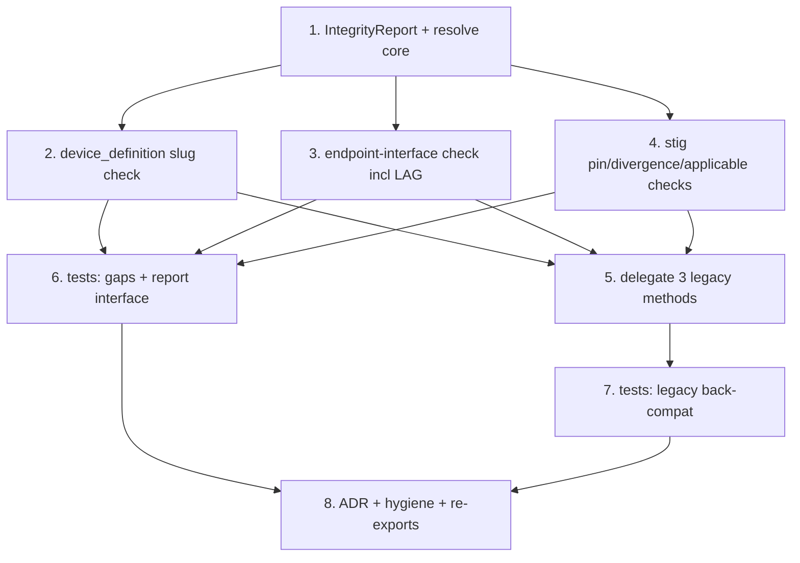

# Implementation Plan

## Overview

Incremental, test-driven consolidation of cross-aggregate reference resolution into
one opt-in module (`network_models/system/resolve.py`) exposing `resolve(...)` and a
serializable `IntegrityReport`. The build order is: define the report + `resolve()`
core, close the two silent gaps (device-definition slug, endpoint interface), move
the STIG pin/divergence/applicable checks into the resolver, reimplement the three
legacy methods to delegate to the resolver's focused checks (back-compat), add
tests, then record the opt-in ADR and finish hygiene/re-exports. Every step keeps
the model core **acyclic** (models never import the resolver at load) and lands with
tests run via `.venv/bin/python -m pytest -q`.

Note on the existing code: the three scattered methods already exist —
`System.validate_stig_assignments`, `System.stig_divergences`
(`network_models/system/topology.py`), and `DeviceDefinition.validate_against_catalog`
(`network_models/device/definition.py`). This spec does **not** delete them; it
reimplements them to delegate to the new resolver so there is one implementation.
The intra-aggregate `System` validators (component→enclave, connection→component,
switchport→VLAN) are left untouched.

## Task Dependency Graph



```json
{
  "waves": [
    { "wave": 1, "tasks": ["1"] },
    { "wave": 2, "tasks": ["2", "3", "4"] },
    { "wave": 3, "tasks": ["5", "6"] },
    { "wave": 4, "tasks": ["7"] },
    { "wave": 5, "tasks": ["8"] }
  ]
}
```

## Tasks

- [ ] 1. Create `network_models/system/resolve.py` with `IntegrityReport` and the `resolve()` core
  - Re-read `network_models/system/topology.py` (`System`, `Component`, `Endpoint`)
    and `network_models/base.py` before writing.
  - Define `IntegrityReport(StrictModel)` with the five structured list fields per
    design §2.1: `unresolved_device_definitions: list[tuple[str, str]]`,
    `unresolved_endpoint_interfaces: list[tuple[str, str]]`,
    `unresolved_stig_pins: list[tuple[str, str, str]]`,
    `unresolved_applicable_stigs: list[tuple[str, str]]`,
    `stig_divergences: list[tuple[str, str]]` (all `default_factory=list`).
  - Add `.ok` property (True iff the four error-class lists are empty; divergences
    excluded), `.errors()` (one string per error-class finding), `.warnings()`
    (divergence strings), and `.raise_for_errors()` (one aggregated `ValueError`
    when not ok).
  - Add `resolve(system, *, definitions=None, catalog=None) -> IntegrityReport`
    scaffold that constructs an empty `IntegrityReport`, runs only the checks whose
    aggregate is supplied, and never raises. Import model types under
    `TYPE_CHECKING` only; keep the module importing models one-directionally.
  - Declare `__all__ = ["IntegrityReport", "resolve"]`.
  - _Requirements: 1.1, 1.2, 1.3, 1.4, 1.5, 5.1, 5.2, 5.3, 5.4, 5.5, 5.6, 8.1, 8.3, 8.4_ (design §2.1, §2.2)

- [ ] 2. Add the device-definition slug check (`_check_device_definitions`)
  - Re-read `Component.device_definition` and `DeviceDefinitionLibrary.definitions`
    in the current code before writing.
  - Implement `_check_device_definitions(system, by_slug)` returning
    `(component_id, slug)` for every component whose non-null `device_definition` is
    absent from the library's slugs; skip components whose `device_definition` is
    `None`.
  - Wire it into `resolve(...)` under the `definitions is not None` branch, indexing
    the library once into `by_slug = {d.slug: d for d in definitions.definitions}`.
  - _Requirements: 2.1, 2.2, 2.3, 2.4_ (design §2.2)

- [ ] 3. Add the endpoint-interface check (`_check_endpoint_interfaces`), including LAG members
  - Re-read `Endpoint` (`interface`, `members`) and `Interface.name` on
    `DeviceDefinition.interfaces` in the current code before writing.
  - Implement `_check_endpoint_interfaces(system, by_slug)` that, for each connection
    endpoint, resolves the endpoint's component → its `device_definition` → the
    library definition, and records `(component_id, interface)` for every
    `interface` (or each LAG `members` entry) not among the definition's interface
    names.
  - Skip endpoints whose component has no `device_definition` or whose slug does not
    resolve (that gap is already reported by task 2); skip endpoints with no
    `interface` and empty `members`.
  - Wire it into `resolve(...)` under the `definitions is not None` branch.
  - _Requirements: 3.1, 3.2, 3.3, 3.4, 3.5_ (design §2.2)

- [ ] 4. Add the STIG pin, applicable-STIG, and divergence checks
  - Re-read `Component.stig_assignments`, `StigCatalog.get`, `StigCatalog.benchmark_ids`,
    and `DeviceDefinition.applicable_stigs` in the current code before writing.
  - Implement `_check_stig_pins(system, catalog)` → `(component_id, benchmark_id,
    version)` for pins where `catalog.get(benchmark_id, version) is None`.
  - Implement `_check_applicable_stigs(definitions, catalog)` → `(slug, benchmark_id)`
    for definition applicable STIGs absent from `catalog.benchmark_ids()`.
  - Implement `_check_divergences(system, by_slug)` → `(component_id, benchmark_id)`
    a component pins that its resolved device type does not declare; warn-only.
  - Wire into `resolve(...)`: pins under `catalog is not None`; applicable STIGs
    under `definitions is not None and catalog is not None`; divergences under
    `definitions is not None`. Divergences populate `stig_divergences` only and never
    affect `.ok`.
  - _Requirements: 4.1, 4.2, 4.3, 4.4, 4.5_ (design §2.2)

- [ ] 5. Reimplement the three legacy methods to delegate to the resolver
  - Re-read the current bodies of `System.validate_stig_assignments`,
    `System.stig_divergences` (`topology.py`), and
    `DeviceDefinition.validate_against_catalog` (`definition.py`) before editing —
    preserve their exact signatures and raised-message text.
  - `System.validate_stig_assignments(catalog)`: lazily import `_check_stig_pins`
    inside the body, raise a `ValueError` on the first unresolved pin whose message
    preserves `benchmark_id`/`version` (so `test_raises_on_unresolved_pin` and
    `test_raises_on_wrong_version` still match), else return self.
  - `System.stig_divergences(definitions)`: lazily import `_check_divergences`,
    build `by_slug`, return the list; never raise.
  - `DeviceDefinition.validate_against_catalog(catalog)`: lazily import
    `_check_applicable_stigs`, run it for a one-definition library of `self`, raise
    listing unresolved ids (message `applicable_stigs do not resolve in catalog:
    [...]`), else return self.
  - Keep every resolver import lazy (inside the method body) so the model core stays
    acyclic (seam invariant).
  - _Requirements: 6.1, 6.2, 6.3, 6.4, 6.5, 6.6, 7.1, 8.2_ (design §2.3)

- [ ] 6. Create `tests/test_resolve.py` — finding classes, skip behavior, report interface
  - Follow `tests/test_system_stig.py` fixture style (`_make_component`,
    `_make_system`, small `StigCatalog`); add a `DeviceDefinitionLibrary` fixture
    with known slugs/interfaces.
  - One test per finding class: unresolved device-definition slug (Req 2); unresolved
    endpoint interface *and* a LAG-member case (Req 3); unresolved STIG pin (Req 4.1);
    unresolved device applicable STIG (Req 4.2); STIG divergence recorded but
    warn-only (Req 4.3, 4.5).
  - Skip behavior: `resolve(system)` with no aggregates → all lists empty and `.ok`;
    only-`catalog` and only-`definitions` populate only the expected classes (Req 1.4,
    1.5).
  - Report interface: `.ok` excludes divergences; `.errors()` one line per error;
    `.raise_for_errors()` raises iff not ok; IntegrityReport JSON round-trip
    (`model_validate(model_dump(mode="json")) == r`) (Req 5.2–5.6, 9.1–9.4).
  - _Requirements: 9.1, 9.2, 9.3, 9.4_

- [ ] 7. Confirm legacy back-compat and standalone construction
  - Run the existing `tests/test_system_stig.py` and the `validate_against_catalog`
    tests in `tests/test_models.py` unchanged; confirm all still pass after the
    delegation in task 5.
  - Add/extend a test asserting a partial `System` (no library, no catalog) and a
    partial `DeviceDefinition` (no catalog) still construct, and that no resolver
    call happens at model construction (Req 7.2, 7.3).
  - Confirm no model module imports `resolve` at load time (e.g. assert
    `resolve` absent from `sys.modules` after importing `network_models` fresh, or
    inspect that the imports are function-local) (Req 8.2).
  - _Requirements: 6.6, 7.1, 7.2, 7.3, 7.4, 8.2, 9.5_

- [ ] 8. ADR, re-exports, and final verification
  - Create `docs/adr/` and add `0001-opt-in-cross-aggregate-resolution.md` recording
    the decision to keep cross-aggregate resolution opt-in (a resolver function)
    rather than a `model_validator`; rationale: partial drafts must construct
    standalone, the model core must stay acyclic, and models hold no foreign
    aggregates. Use the domain-modeling ADR format (`.kiro/skills/domain-modeling/
    ADR-FORMAT.md`) if present, else Status/Context/Decision/Consequences.
  - Ensure `system/resolve.py` `__all__` flows through `system/__init__.py` and the
    top-level `network_models/__init__.py` re-export (`from network_models import
    resolve, IntegrityReport`).
  - Update steering `structure.md` to list `system/resolve.py` (cross-aggregate
    resolver) under the `system/` package.
  - Run the full suite: `.venv/bin/python -m pytest -q` — all pass.
  - _Requirements: 8.4, 10.1, 10.2, 10.3, 11.1, 11.2, 11.3_

## Notes

- **Acyclic-import seam:** `resolve.py` imports the models; the models import
  `resolve` **only** lazily inside method bodies (or under `TYPE_CHECKING`), never at
  module load. This mirrors the existing `TYPE_CHECKING`-only imports in
  `topology.py` and `definition.py` and is the invariant the ADR records.
- **Opt-in rationale:** none of these checks becomes a `model_validator`. Partial
  `System`/`DeviceDefinition` drafts must construct standalone without the sibling
  aggregates present — the resolver is called explicitly when the caller has them.
- **One implementation (locality):** the three legacy methods delegate to the same
  focused check functions the resolver uses, so each cross-aggregate check exists in
  exactly one place.
- **Divergences are warn-only:** `stig_divergences` never affects `.ok` and is never
  raised by `.raise_for_errors()`, preserving the current `System.stig_divergences`
  semantics.
- **Cross-spec note:** sibling specs exist under `.kiro/specs/` and are independent
  of this one; do not assume their tasks are done. Each task above re-reads the
  current code before editing so it stays correct regardless of sibling progress.
- **Portability:** `network_models/` stays pydantic + stdlib only. No XML, no
  app-layer imports, no new dependencies.
- **Run commands:** `.venv/bin/python -m pytest -q` for the suite.
</content>
