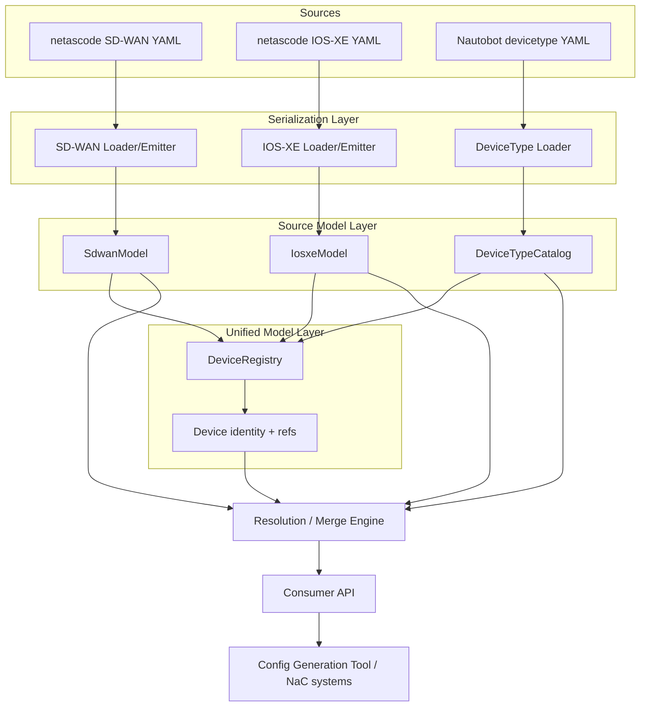
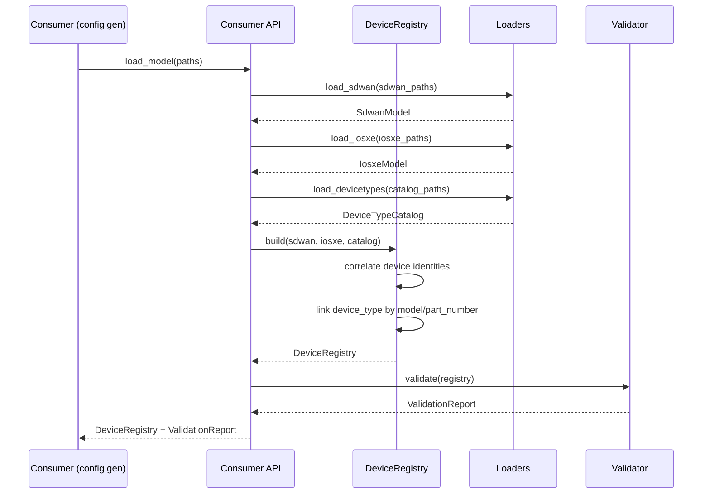
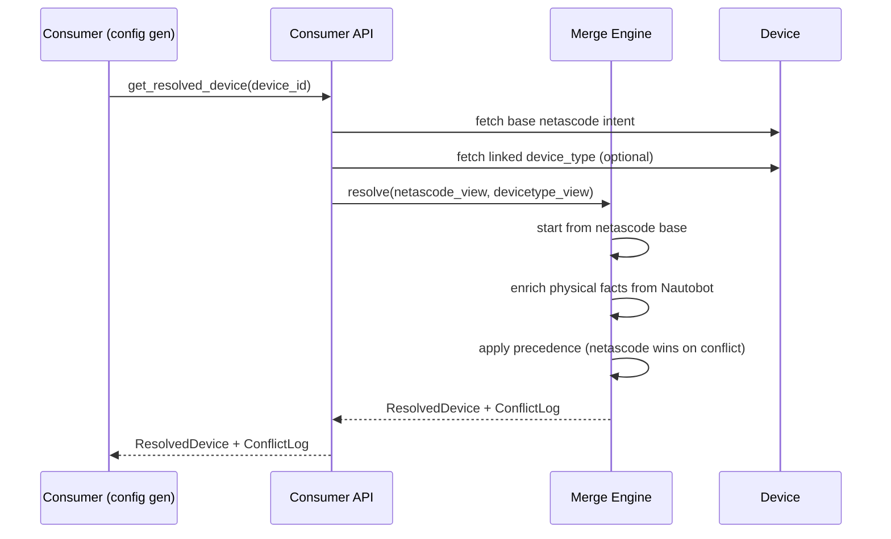

# Design Document: Network Device Data Model

## Overview

This document describes the design of a **network device data model** intended to serve as the
canonical, source-of-truth representation of network devices for a network configuration
generation tool and other "network as code" (NaC) systems. The model treats the Cisco
**Network as Code** data models — specifically the **SD-WAN** and **IOS-XE** models — as the
*primary/base* constructs that must be **fully supported**. It treats the **Nautobot
devicetype-library** model as a *supplementary* layer used to enrich device definitions with
physical hardware facts (rack height, interfaces, ports, module bays) without ever overriding
the netascode constructs.

The core problem this model solves is that a network config generation tool needs two very
different kinds of information about a device: (1) the **intended configuration** (what the
device should be doing — VLANs, VRFs, feature profiles, site/router assignments), which comes
from the netascode domain, and (2) the **physical/catalog facts** (what the device physically
is — its ports, its rack footprint, its part number), which comes from the Nautobot domain.
These two worlds overlap on identity (a device is one physical unit) but use different vocabularies
and are maintained by different teams and tools. This model unifies them under a single device
identity while keeping the two source vocabularies cleanly separated and independently
round-trippable.

The design is a **layered, additive model**. netascode constructs form the base layer and are
represented with full fidelity so that any valid netascode YAML can be losslessly loaded, held,
validated, and re-emitted. The Nautobot device-type layer is attached as an optional enrichment
keyed by device model/part number. A **merge/resolution engine** produces a unified device view
for consumers, and a **precedence policy** guarantees that when the two layers describe the same
attribute, the netascode value always wins. The model is format-agnostic internally (an in-memory
object graph) with YAML as the primary serialization, matching how both source ecosystems store
their data.

## Architecture

The model is organized into five logical layers. The **Serialization layer** loads and emits YAML
for each source vocabulary. The **Source Model layer** holds faithful, per-vocabulary object
representations (netascode SD-WAN, netascode IOS-XE, Nautobot device type). The **Unified Model
layer** exposes a single `Device` identity that references its netascode intent and its optional
Nautobot enrichment. The **Resolution/Merge engine** computes a consumer-facing merged view under
a strict precedence policy. The **Consumer API layer** is the stable surface that a config
generator or other NaC system calls.



Key architectural decisions and rationale:

- **Faithful source models over a single flattened schema.** Because netascode SD-WAN and IOS-XE
  must be *fully* supported and are large, evolving schemas, the design preserves each source
  vocabulary as its own object tree rather than forcing everything into one normalized schema.
  This guarantees lossless round-tripping and lets the model track upstream schema changes with
  minimal blast radius.
- **Additive enrichment, never mutation.** Nautobot data is attached alongside netascode data, not
  merged into it at rest. Merging happens only on demand in the resolution engine, so the base
  netascode intent is always recoverable unchanged.
- **Explicit precedence policy.** A single, centrally defined precedence rule (netascode > Nautobot)
  removes ambiguity when both layers describe the same conceptual attribute (e.g., interface list).
- **Device identity as the join key.** Devices are correlated across layers by a stable identity
  derived from netascode (device name / chassis_id) and linked to Nautobot via device model/part
  number, so the physical catalog can be shared across many device instances.

## Sequence Diagrams

### Load and build unified registry



### Resolve a device view for a consumer



## Components and Interfaces

### Component 1: Source Loaders / Emitters

**Purpose**: Convert YAML documents to/from faithful source models for each vocabulary, preserving
all fields (including unknown-but-valid keys) to guarantee round-tripping.

**Interface**:

```pascal
INTERFACE SourceSerialization
  PROCEDURE load_sdwan(paths: List<Path>) : SdwanModel
  PROCEDURE load_iosxe(paths: List<Path>) : IosxeModel
  PROCEDURE load_devicetypes(paths: List<Path>) : DeviceTypeCatalog
  PROCEDURE emit_sdwan(model: SdwanModel) : YamlDocument
  PROCEDURE emit_iosxe(model: IosxeModel) : YamlDocument
END INTERFACE
```

**Responsibilities**:
- Parse and merge multiple YAML files per vocabulary (both source ecosystems split data across files).
- Preserve unrecognized-but-schema-valid keys so upstream additions do not cause data loss.
- Emit netascode models back to YAML byte-for-semantics equivalent to input.

### Component 2: DeviceRegistry (Unified Model)

**Purpose**: Hold the single source of truth: all devices keyed by identity, each linking to its
netascode intent (SD-WAN router and/or IOS-XE device) and its optional Nautobot device type.

**Interface**:

```pascal
INTERFACE DeviceRegistry
  PROCEDURE build(sdwan: SdwanModel, iosxe: IosxeModel, catalog: DeviceTypeCatalog) : DeviceRegistry
  PROCEDURE get_device(device_id: DeviceId) : Device
  PROCEDURE list_devices() : List<Device>
  PROCEDURE link_device_type(device_id: DeviceId, key: DeviceTypeKey) : Void
END INTERFACE
```

**Responsibilities**:
- Correlate SD-WAN routers and IOS-XE devices that refer to the same physical unit into one `Device`.
- Resolve each device's `model`/`part_number` against the device-type catalog to attach enrichment.
- Provide lookup and enumeration for consumers and the merge engine.

### Component 3: Resolution / Merge Engine

**Purpose**: Produce a consumer-facing `ResolvedDevice` that combines netascode intent with Nautobot
physical facts under the fixed precedence policy, and report any conflicts.

**Interface**:

```pascal
INTERFACE MergeEngine
  PROCEDURE resolve(device: Device) : ResolvedDevice
  PROCEDURE resolve_all(registry: DeviceRegistry) : List<ResolvedDevice>
END INTERFACE
```

**Responsibilities**:
- Treat the netascode view as the authoritative base.
- Add physical attributes (u_height, hardware interface inventory, ports, module bays) from Nautobot
  where netascode is silent.
- On any attribute described by both layers, keep the netascode value and record a `Conflict`.

### Component 4: Validator

**Purpose**: Check structural and cross-layer integrity independent of the source schema validators.

**Interface**:

```pascal
INTERFACE Validator
  PROCEDURE validate(registry: DeviceRegistry) : ValidationReport
END INTERFACE
```

**Responsibilities**:
- Enforce mandatory netascode fields (e.g., SD-WAN `sites[].id`, `routers[].chassis_id`; IOS-XE
  `devices[].name`).
- Enforce identity uniqueness and referential integrity (device_group refs, template refs, device_type link).
- Flag Nautobot interfaces that have no netascode counterpart (informational, not fatal).

### Component 5: Consumer API

**Purpose**: The stable facade the config generator and other NaC systems depend on.

**Interface**:

```pascal
INTERFACE ConsumerApi
  PROCEDURE load_model(config: LoadConfig) : LoadResult
  PROCEDURE get_resolved_device(device_id: DeviceId) : ResolvedDevice
  PROCEDURE list_resolved_devices() : List<ResolvedDevice>
  PROCEDURE get_variable(device_id: DeviceId, name: String) : Optional<Value>
END INTERFACE
```

**Responsibilities**:
- Orchestrate load → build → validate → resolve.
- Expose netascode variable resolution honoring device > device_group > global precedence.

## Data Models

The data model is expressed in three source-faithful sub-models plus one unified/resolved model.
netascode sub-models are the base and are represented with full fidelity; the Nautobot sub-model is
supplementary. All structures below are shown in structured pseudocode. Fields marked `Mandatory`
mirror the upstream netascode constraints discovered during research.

### 2.1 netascode SD-WAN sub-model (BASE — must be fully supported)

The SD-WAN Manager configuration has eight top-level sections. The model represents all of them; the
device-bearing section is `sites` → `routers`.

```pascal
STRUCTURE SdwanModel
  feature_profiles     : List<FeatureProfile>       // UX 2.0 grouping of features
  features             : List<Feature>              // UX 2.0 per-feature config
  edge_feature_templates : List<EdgeFeatureTemplate> // UX 1.0
  edge_device_templates  : List<EdgeDeviceTemplate>  // UX 1.0, composed of feature templates
  policy_objects       : List<PolicyObject>         // groups used in policy 'match'
  localized_policies   : List<LocalizedPolicy>      // applied locally on edge routers
  centralized_policies : List<CentralizedPolicy>    // applied globally
  security_policies    : List<SecurityPolicy>       // firewall, IPS, etc.
  sites                : List<Site>                 // site/node specific variable values
  management_ip_variable : Optional<String>         // global D2D mgmt IP variable name
END STRUCTURE

STRUCTURE Site
  id      : Integer      // Mandatory, min: 1, max: 4294967295
  routers : List<Router> // Mandatory
END STRUCTURE

STRUCTURE Router
  chassis_id                 : String    // Mandatory, physical chassis identity
  model                      : Optional<String>  // Choice enum (C8000V, ASR-1001-X, ...)
  management_ip_variable     : Optional<String>   // overrides global; regex ^[^"~`$&+,]{1,255}$
  configuration_group        : Optional<String>   // regex ^[^<>!&" ]{1,128}$
  configuration_group_deploy : Boolean   // default true
  policy_group               : Optional<String>
  policy_group_deploy        : Boolean   // default true
  tags                       : List<String>
  topology_label             : Optional<String>
  device_template            : Optional<String>
  device_variables           : Map<String, Value>  // device-specific ${...} values
  policy_variables           : Map<String, Value>
END STRUCTURE
```

**Validation Rules (SD-WAN)**:
- `Site.id` mandatory and within [1, 4294967295].
- `Site.routers` mandatory and non-empty.
- `Router.chassis_id` mandatory and unique across the whole model.
- A router references at most one of `device_template` OR (`configuration_group`/`policy_group`),
  matching the UX 1.0 vs UX 2.0 split; both present is a validation warning.
- Security-policy variables use the `vedgePolicy/` prefix in `device_variables` and are preserved verbatim.

### 2.2 netascode IOS-XE sub-model (BASE — must be fully supported)

IOS-XE is divided into `entity` (devices, device_groups, global, interface_groups, templates),
`device`-level config, and `interface`-level config, with a strict precedence
**device > device_group > global**.

```pascal
STRUCTURE IosxeModel
  devices          : List<IosxeDevice>
  device_groups    : List<DeviceGroup>
  global           : Optional<GlobalScope>
  interface_groups : List<InterfaceGroup>
  templates        : List<Template>
END STRUCTURE

STRUCTURE IosxeDevice
  name          : String              // Mandatory, unique identifier
  host          : Optional<String>    // management IP (HTTPS/RESTCONF)
  managed       : Boolean             // default true; false = skip during deploy
  protocol      : Optional<Choice>    // restconf | netconf
  version       : Optional<String>
  device_groups : List<String>        // group memberships
  variables     : Map<String, Value>  // highest-precedence variables
  templates     : List<String>
  configuration : Optional<Configuration> // highest-precedence config tree
END STRUCTURE

STRUCTURE DeviceGroup
  name          : String
  devices       : List<String>
  variables     : Map<String, Value>
  templates     : List<String>
  configuration : Optional<Configuration>
END STRUCTURE

STRUCTURE GlobalScope
  variables     : Map<String, Value>
  configuration : Optional<Configuration>
END STRUCTURE

STRUCTURE InterfaceGroup
  name          : String
  configuration : Optional<Configuration>  // applied to referenced interfaces
END STRUCTURE

STRUCTURE Template
  name          : String
  type          : Choice   // model | file
  file          : Optional<Path>          // when type = file (.tftpl)
  configuration : Optional<Configuration> // when type = model
END STRUCTURE

// Configuration is an open, nested tree (system, interfaces, vlan, vrf, routing, ...).
// It is kept as a schema-preserving tree so the full IOS-XE model is supported without
// enumerating every leaf here.
STRUCTURE Configuration
  sections : Map<String, ConfigNode>   // e.g. "system", "interfaces", "vlan"
END STRUCTURE

STRUCTURE ConfigNode
  VARIANT Scalar(value: Value)
  VARIANT Sequence(items: List<ConfigNode>)
  VARIANT Mapping(entries: Map<String, ConfigNode>)
END STRUCTURE
```

**Validation Rules (IOS-XE)**:
- `IosxeDevice.name` mandatory and unique.
- `protocol` restricted to `restconf | netconf`.
- Every string in `device_groups` must reference an existing `DeviceGroup.name` (or be creatable).
- Every string in `templates` must reference an existing `Template.name`.
- `${var}` placeholders resolve against device > device_group > global variables.

### 2.3 Nautobot device-type sub-model (SUPPLEMENTARY — enrichment only)

Represents a make/model of hardware and its physical components. Shared across many device instances
via `DeviceTypeKey` (manufacturer + part_number/slug).

```pascal
STRUCTURE DeviceTypeCatalog
  device_types : Map<DeviceTypeKey, DeviceType>
END STRUCTURE

STRUCTURE DeviceTypeKey
  manufacturer : String
  part_number  : String   // e.g. "C9300-48P"; slug used as fallback
END STRUCTURE

STRUCTURE DeviceType
  manufacturer  : String            // Mandatory
  model         : String            // Mandatory, e.g. "Catalyst 9300-48P"
  part_number   : Optional<String>
  slug          : String            // Mandatory, unique catalog id
  u_height      : Number            // rack units
  is_full_depth : Boolean
  weight        : Optional<Number>
  weight_unit   : Optional<String>
  airflow       : Optional<String>
  comments      : Optional<String>
  console_ports : List<ConsolePort>
  power_ports   : List<PowerPort>
  interfaces    : List<HwInterface>
  module_bays   : List<ModuleBay>
END STRUCTURE

STRUCTURE HwInterface
  name      : String        // e.g. "GigabitEthernet1/0/1"
  type      : String        // e.g. "1000base-t", "cisco-stackwise"
  poe_mode  : Optional<String>  // e.g. "pse"
  poe_type  : Optional<String>
  mgmt_only : Boolean       // default false
END STRUCTURE

STRUCTURE ConsolePort  name: String; type: String END STRUCTURE
STRUCTURE PowerPort    name: String; type: Optional<String> END STRUCTURE
STRUCTURE ModuleBay    name: String; position: String END STRUCTURE
```

**Validation Rules (Nautobot)**:
- `manufacturer`, `model`, `slug` mandatory; `slug` unique in catalog.
- Purely supplementary: absence of a matching device type is never fatal.
- Hardware interface `name` values are compared to netascode interface names for enrichment/consistency
  reporting only.

### 2.4 Unified and Resolved models

```pascal
STRUCTURE DeviceId
  value : String   // canonical identity (see identity derivation algorithm)
END STRUCTURE

STRUCTURE Device
  id             : DeviceId
  sdwan_router   : Optional<Reference<Router>>       // base intent (SD-WAN)
  iosxe_device   : Optional<Reference<IosxeDevice>>  // base intent (IOS-XE)
  device_type    : Optional<Reference<DeviceType>>   // supplementary enrichment
END STRUCTURE

STRUCTURE ResolvedDevice
  id                : DeviceId
  source_platform   : Choice        // sdwan | iosxe | both
  model             : Optional<String>
  // netascode-authoritative fields
  intent            : ResolvedIntent
  // Nautobot-supplementary fields (only where netascode is silent)
  physical          : Optional<PhysicalFacts>
  // merged interface view: netascode config wins, hardware facts fill gaps
  interfaces        : List<ResolvedInterface>
  conflicts         : List<Conflict>
END STRUCTURE

STRUCTURE ResolvedInterface
  name              : String
  intent_config     : Optional<ConfigNode>  // from netascode (authoritative)
  hardware_type     : Optional<String>      // from Nautobot (supplementary)
  poe_mode          : Optional<String>
  mgmt_only         : Boolean
  origin            : Choice   // netascode_only | nautobot_only | both
END STRUCTURE

STRUCTURE Conflict
  device_id  : DeviceId
  attribute  : String
  netascode_value : Value    // winning value
  nautobot_value  : Value    // discarded value (recorded for visibility)
END STRUCTURE
```

## Algorithmic Pseudocode

### Algorithm 1: Build unified DeviceRegistry

```pascal
ALGORITHM buildRegistry(sdwan, iosxe, catalog)
INPUT:  sdwan : SdwanModel, iosxe : IosxeModel, catalog : DeviceTypeCatalog
OUTPUT: registry : DeviceRegistry

BEGIN
  ASSERT sdwan <> NULL AND iosxe <> NULL AND catalog <> NULL

  registry.devices ← empty Map<DeviceId, Device>

  // Step 1: ingest SD-WAN routers as base intent
  FOR each site IN sdwan.sites DO
    ASSERT site.id >= 1 AND site.id <= 4294967295
    FOR each router IN site.routers DO
      ASSERT router.chassis_id <> ""
      id ← deriveIdentity(sdwan_router := router)
      dev ← registry.devices.getOrCreate(id)
      dev.sdwan_router ← reference(router)
    END FOR
  END FOR

  // Step 2: ingest IOS-XE devices as base intent, correlating with existing identities
  FOR each d IN iosxe.devices DO
    ASSERT d.name <> ""
    id ← deriveIdentity(iosxe_device := d)
    dev ← registry.devices.getOrCreate(id)
    dev.iosxe_device ← reference(d)
  END FOR

  // Step 3: attach supplementary device-type enrichment (never overrides intent)
  FOR each dev IN registry.devices.values() DO
    modelName ← modelOf(dev)          // from sdwan_router.model or iosxe config
    IF modelName <> NULL THEN
      key ← catalog.findKeyByModelOrPart(modelName)
      IF key <> NULL THEN
        dev.device_type ← reference(catalog.device_types[key])
      END IF
    END IF
  END FOR

  ASSERT allIdentitiesUnique(registry)
  RETURN registry
END
```

**Preconditions:**
- All three source models are loaded and individually well-formed.
- SD-WAN mandatory fields (`site.id`, `router.chassis_id`) and IOS-XE `device.name` are present.

**Postconditions:**
- Every SD-WAN router and every IOS-XE device is represented by exactly one `Device`.
- Each `Device` has a unique `DeviceId`.
- `device_type` is set only when a catalog match exists; it is never required.
- No netascode field is mutated during build (enrichment is by reference only).

**Loop Invariants:**
- After each iteration of Step 1/2, `registry.devices` contains one entry per distinct identity seen so far.
- After each iteration of Step 3, all previously processed devices retain their base intent unchanged.

### Algorithm 2: Resolve a device (merge with precedence)

```pascal
ALGORITHM resolveDevice(dev)
INPUT:  dev : Device
OUTPUT: resolved : ResolvedDevice

BEGIN
  ASSERT dev.sdwan_router <> NULL OR dev.iosxe_device <> NULL   // must have base intent

  resolved.id ← dev.id
  resolved.conflicts ← empty List
  resolved.source_platform ← platformOf(dev)

  // Step 1: seed authoritative fields from netascode base (intent always wins)
  resolved.intent ← buildIntent(dev.sdwan_router, dev.iosxe_device)
  resolved.model  ← modelOf(dev)

  // Step 2: enrich physical facts from Nautobot ONLY where netascode is silent
  IF dev.device_type <> NULL THEN
    resolved.physical ← extractPhysicalFacts(dev.device_type)  // u_height, ports, module bays
  ELSE
    resolved.physical ← NULL
  END IF

  // Step 3: merge interface views
  resolved.interfaces ← mergeInterfaces(resolved.intent, dev.device_type, resolved.conflicts, dev.id)

  RETURN resolved
END
```

**Preconditions:**
- `dev` has at least one netascode base (SD-WAN router or IOS-XE device).

**Postconditions:**
- Every authoritative field in `resolved.intent` equals the corresponding netascode value.
- `resolved.physical` is populated only from Nautobot and only when a device type is linked.
- Every attribute present in both layers appears in `resolved.conflicts` with the netascode value winning.

**Loop Invariants:** N/A at this level (delegated to `mergeInterfaces`).

### Algorithm 3: Merge interfaces under precedence policy

```pascal
ALGORITHM mergeInterfaces(intent, deviceType, conflicts, deviceId)
INPUT:  intent : ResolvedIntent,
        deviceType : Optional<DeviceType>,
        conflicts : List<Conflict>  (mutated),
        deviceId : DeviceId
OUTPUT: merged : List<ResolvedInterface>

BEGIN
  merged ← empty List
  byName ← empty Map<String, ResolvedInterface>

  // Step 1: netascode-configured interfaces are authoritative
  FOR each ifCfg IN intent.interfaceConfigs DO
    ri ← new ResolvedInterface
    ri.name ← ifCfg.name
    ri.intent_config ← ifCfg.node
    ri.origin ← netascode_only
    byName[ri.name] ← ri
  END FOR

  // Step 2: overlay hardware facts from Nautobot
  IF deviceType <> NULL THEN
    FOR each hw IN deviceType.interfaces DO
      ASSERT invariant_allProcessedAreConsistent(merged)
      IF byName.contains(hw.name) THEN
        ri ← byName[hw.name]
        ri.hardware_type ← hw.type            // fill supplementary fact
        ri.poe_mode ← hw.poe_mode
        ri.mgmt_only ← hw.mgmt_only
        ri.origin ← both
        // netascode intent_config is NOT overwritten; if hw claimed a conflicting
        // intent-level attribute it would be logged, but hw carries only physical facts
      ELSE
        ri ← new ResolvedInterface
        ri.name ← hw.name
        ri.hardware_type ← hw.type
        ri.poe_mode ← hw.poe_mode
        ri.mgmt_only ← hw.mgmt_only
        ri.origin ← nautobot_only            // hardware port with no intent yet
        byName[hw.name] ← ri
      END IF
    END FOR
  END IF

  merged ← byName.values() ordered by name
  RETURN merged
END
```

**Preconditions:**
- `intent` is derived from netascode; `deviceType` may be NULL.

**Postconditions:**
- For every interface configured in netascode, `intent_config` is preserved exactly.
- Nautobot only contributes physical facts (`hardware_type`, `poe_mode`, `mgmt_only`).
- Interfaces present only in hardware are marked `nautobot_only`; only in netascode `netascode_only`; both `both`.

**Loop Invariants:**
- `invariant_allProcessedAreConsistent(merged)`: every already-merged interface has its netascode
  `intent_config` unchanged from when it was inserted.

### Algorithm 4: Resolve a netascode variable (device > group > global)

```pascal
ALGORITHM resolveVariable(iosxe, deviceName, varName)
INPUT:  iosxe : IosxeModel, deviceName : String, varName : String
OUTPUT: value : Optional<Value>

BEGIN
  device ← iosxe.findDevice(deviceName)
  IF device = NULL THEN RETURN NONE END IF

  // Step 1: device scope (highest precedence)
  IF device.variables.contains(varName) THEN
    RETURN SOME(device.variables[varName])
  END IF

  // Step 2: device_group scope (in listed order)
  FOR each groupName IN device.device_groups DO
    group ← iosxe.findGroup(groupName)
    IF group <> NULL AND group.variables.contains(varName) THEN
      RETURN SOME(group.variables[varName])
    END IF
  END FOR

  // Step 3: global scope (lowest precedence)
  IF iosxe.global <> NULL AND iosxe.global.variables.contains(varName) THEN
    RETURN SOME(iosxe.global.variables[varName])
  END IF

  RETURN NONE
END
```

**Preconditions:**
- `iosxe` is a well-formed model; `deviceName` and `varName` are non-empty strings.

**Postconditions:**
- Returns the device-scoped value if present; else the first matching group value; else global; else NONE.
- Never returns a lower-precedence value when a higher-precedence one exists.

**Loop Invariants:**
- When iterating device_groups, no group checked so far (before the returned one) defined `varName`.

## Key Functions with Formal Specifications

### Function: deriveIdentity()

```pascal
FUNCTION deriveIdentity(sdwan_router: Optional<Router>, iosxe_device: Optional<IosxeDevice>) : DeviceId
```

**Preconditions:**
- Exactly one of `sdwan_router` / `iosxe_device` is provided per call (correlation of the two
  happens by identity equality in the registry, not inside this function).

**Postconditions:**
- Returns a deterministic `DeviceId`: for SD-WAN, derived from `chassis_id`; for IOS-XE, from `name`.
- Two calls with equal identifying inputs return equal `DeviceId` (referential transparency).
- No side effects.

### Function: linkDeviceType()

```pascal
FUNCTION linkDeviceType(catalog: DeviceTypeCatalog, modelName: String) : Optional<Reference<DeviceType>>
```

**Preconditions:**
- `catalog` is loaded; `modelName` may be empty.

**Postconditions:**
- Returns a reference iff a device type matches by `part_number`, then `model`, then `slug`.
- Never mutates `catalog` or the returned device type.
- Absence of a match yields NONE and is not an error.

### Function: validateRegistry()

```pascal
FUNCTION validateRegistry(registry: DeviceRegistry) : ValidationReport
```

**Preconditions:**
- `registry` has been built by `buildRegistry`.

**Postconditions:**
- Report contains one ERROR per violated mandatory/uniqueness/referential rule.
- Report contains INFO entries for Nautobot-only interfaces (hardware ports with no netascode intent).
- Returns an empty-error report iff the registry satisfies all netascode mandatory constraints.

**Loop Invariants:**
- All devices inspected so far have had every applicable rule evaluated and recorded.

## Example Usage

```pascal
SEQUENCE
  // 1. Load all three source vocabularies
  sdwan   ← load_sdwan(["data/sdwan/"])
  iosxe   ← load_iosxe(["data/iosxe/"])
  catalog ← load_devicetypes(["vendor/nautobot/device-types/Cisco/"])

  // 2. Build unified registry and validate
  registry ← buildRegistry(sdwan, iosxe, catalog)
  report   ← validateRegistry(registry)
  IF report.hasErrors() THEN
    DISPLAY report.errors
    ABORT
  END IF

  // 3. Consumer (config generator) resolves a device
  dev      ← registry.get_device(DeviceId("C8K-3D1A8960-6E76-532C-DA93-50626FC5797E"))
  resolved ← resolveDevice(dev)

  // 4. netascode intent is authoritative; Nautobot enriches physical facts
  DISPLAY resolved.model                      // e.g. "C8000V"
  DISPLAY resolved.physical.u_height          // from Nautobot (supplementary)
  FOR each iface IN resolved.interfaces DO
    // intent_config drives config generation; hardware_type is informational
    generateInterfaceConfig(iface.intent_config, iface.hardware_type)
  END FOR

  // 5. Any overlap was resolved in favor of netascode and logged
  FOR each c IN resolved.conflicts DO
    LOG "netascode wins for " + c.attribute + ": kept " + c.netascode_value
  END FOR
END SEQUENCE
```

## Correctness Properties

These properties define the contract the implementation must uphold and drive the property-based tests.

### Property 1: netascode round-trip fidelity

For every valid netascode model `m`, `load(emit(m)) == m`. Loading then emitting then loading again
is stable (idempotent).

### Property 2: netascode precedence dominance

For every resolved device `r` and every attribute `a` present in both the netascode and Nautobot
layers, `r.value(a) == netascode.value(a)`. Nautobot never overrides netascode.

### Property 3: Supplementary-only enrichment

For every resolved device `r`, every field sourced from Nautobot is either (a) a physical fact with
no netascode equivalent, or (b) recorded in `r.conflicts` with the netascode value winning. Nautobot
cannot introduce intent.

### Property 4: Identity uniqueness

For every registry built from valid inputs, all `DeviceId` values are distinct, and each SD-WAN
router / IOS-XE device maps to exactly one device.

### Property 5: Enrichment optionality

For every device with no matching device type, `resolveDevice` succeeds and produces a
`ResolvedDevice` whose intent equals the netascode base (no error).

### Property 6: Variable precedence monotonicity

For every device, if a variable is defined at the device scope, `resolveVariable` returns the device
value regardless of group/global definitions; group beats global likewise.

### Property 7: Mandatory-field enforcement

For every model missing a netascode mandatory field (`site.id`, `router.chassis_id`, `device.name`),
`validateRegistry` returns at least one error.

### Property 8: Interface merge completeness

For every resolved device, the merged interface set equals the union of netascode-configured
interfaces and Nautobot hardware interfaces, with correct `origin` labels and no duplicates by name.

## Error Handling

### Error Scenario 1: Malformed source YAML
**Condition**: A YAML file fails to parse or violates the source schema.
**Response**: The relevant loader raises a `SourceLoadError` naming the file and location; no partial
model is returned for that vocabulary.
**Recovery**: Caller fixes the file; other vocabularies are unaffected because loads are independent.

### Error Scenario 2: Missing netascode mandatory field
**Condition**: `site.id`, `router.chassis_id`, or `device.name` absent.
**Response**: `validateRegistry` records an ERROR; build succeeds but the report is non-empty.
**Recovery**: Consumers must not proceed to generation while errors exist (see Example Usage step 2).

### Error Scenario 3: Duplicate identity
**Condition**: Two routers share a `chassis_id`, or two IOS-XE devices share a `name`.
**Response**: `buildRegistry`'s `allIdentitiesUnique` assertion fails → `IdentityConflictError`.
**Recovery**: Deduplicate source data; identity is the join key and must be unique.

### Error Scenario 4: Unresolvable device type
**Condition**: A device's `model` has no catalog match.
**Response**: Non-fatal. `device_type` stays NULL; validator emits INFO, not ERROR.
**Recovery**: Optionally add the device type to the catalog to gain enrichment; not required.

### Error Scenario 5: Nautobot/netascode interface mismatch
**Condition**: Hardware defines interfaces absent from netascode intent, or vice versa.
**Response**: Both are retained in the merged view with `origin` = `nautobot_only` / `netascode_only`;
validator emits INFO.
**Recovery**: Informational only; consumers decide whether unconfigured hardware ports matter.

## Testing Strategy

### Unit Testing Approach
Cover each algorithm in isolation: identity derivation determinism, device-type linking fallbacks
(part_number → model → slug), variable precedence resolution, and per-scenario error handling. Use
small hand-built fixtures for each netascode section and a couple of Nautobot device types
(e.g., C9300-48P, C8000V).

### Property-Based Testing Approach
Encode the eight Correctness Properties as generative tests. Generate random-but-valid combined
models (SD-WAN + IOS-XE + partial catalog) and assert round-trip fidelity, precedence dominance,
supplementary-only enrichment, identity uniqueness, enrichment optionality, and interface-merge
completeness.

**Property Test Library**: Hypothesis (Python) if the tooling is implemented in Python; otherwise
fast-check (JS/TS) or QuickCheck (Haskell). Selection follows the implementation language chosen at
build time.

### Integration Testing Approach
Load a realistic slice of actual netascode SD-WAN and IOS-XE sample data plus real Nautobot
device-type YAML from the referenced library, build the registry, resolve all devices, and assert
that emitted netascode YAML re-imports cleanly and that a downstream config-generation dry run
consumes the resolved views without error.

## Performance Considerations

- Loading is O(total YAML size); building is O(#routers + #devices + #interfaces).
- The device-type catalog is indexed by `DeviceTypeKey` for O(1) linking; interface merge is O(n) via
  a name-keyed map.
- Resolution is computed on demand and can be cached per `DeviceId`; the base models are immutable
  after load, making caching safe.
- Target: thousands of devices and tens of thousands of interfaces resolve in well under a second on
  commodity hardware; no design element requires super-linear work.

## Security Considerations

- Source YAML is untrusted input: use a safe YAML loader (no arbitrary object construction) to prevent
  code execution via crafted tags.
- `device_variables` and IOS-XE `variables` may contain secrets (keys, community strings). The model
  stores them but consumers should avoid logging resolved variable values; the conflict log references
  attribute names, not secret values, by default.
- The model performs no outbound network calls; it operates purely on local data, minimizing exposure.

## Dependencies

- A YAML parser/emitter with safe-load support (e.g., PyYAML/ruamel.yaml, js-yaml, or equivalent).
- A property-based testing library (Hypothesis / fast-check / QuickCheck) for the correctness properties.
- Source reference materials (documentation only, not runtime deps): Cisco netascode SD-WAN and IOS-XE
  data models, and the Nautobot/NetBox devicetype-library YAML corpus for the supplementary catalog.
- No dependency on Terraform at the model layer; Terraform remains the downstream rendering engine in
  the netascode ecosystem and is out of scope for this data model.
