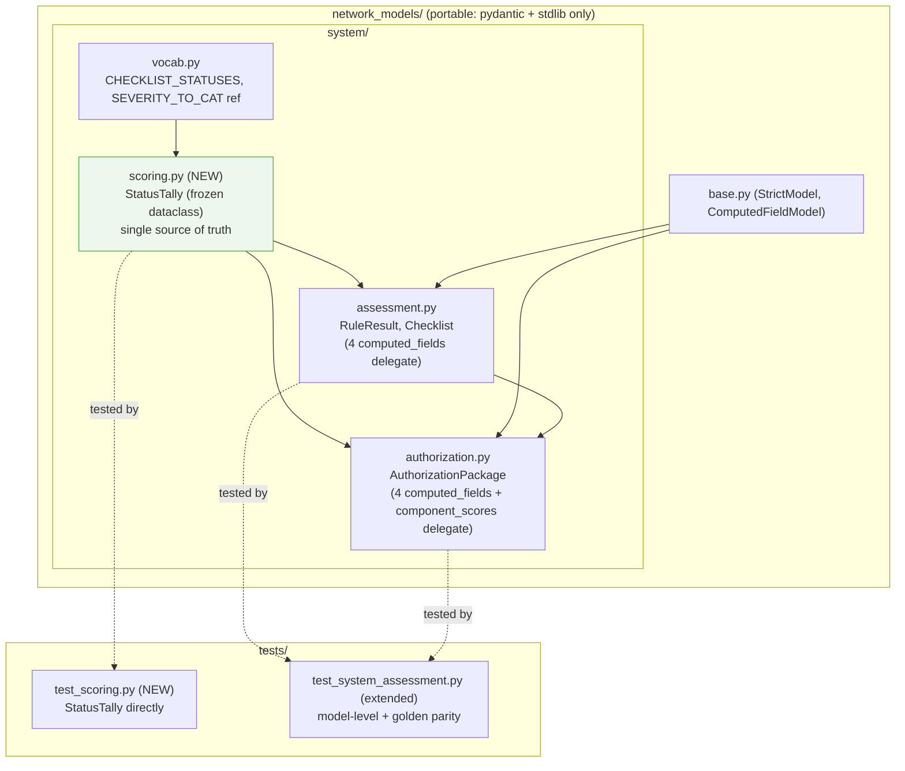
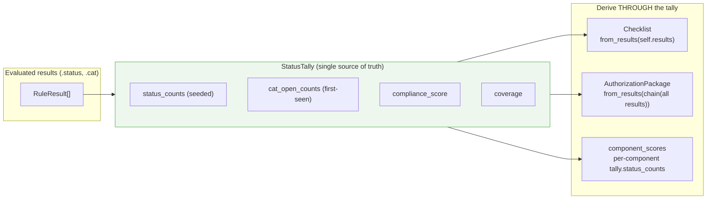
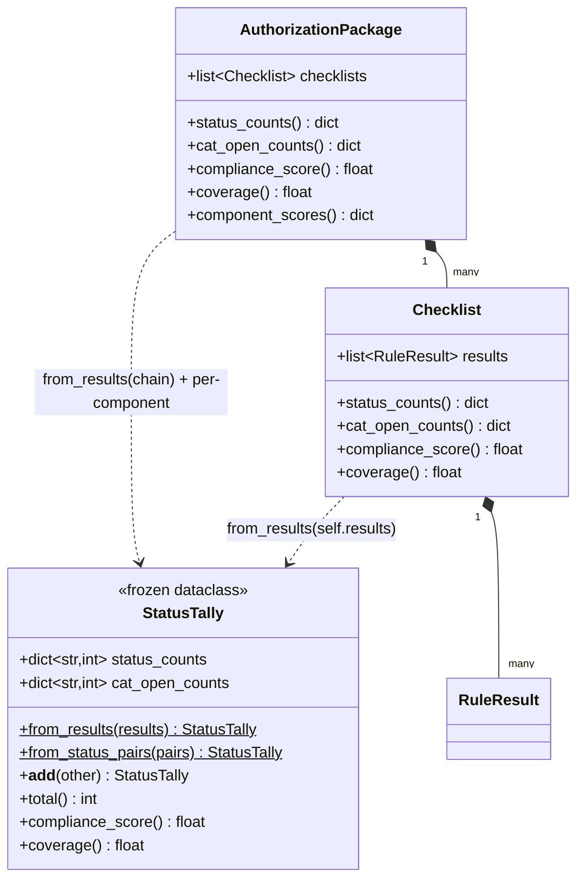

# Design Document: rmf-scoring-tally

## Overview

The RMF compliance-scoring math in `network_models/system/` is **duplicated**.
`Checklist` (`assessment.py`) computes four metrics — `status_counts`,
`cat_open_counts`, `compliance_score`, `coverage` — as `@computed_field`
properties over its `RuleResult` lines. `AuthorizationPackage` (`authorization.py`)
re-implements the *same four* system-wide across many checklists and adds
`component_scores`. The RMF conventions (`assessable = total − Not_Applicable`,
empty → `100.0`, `Not_Reviewed` stays in the denominator, `round(..., 1)`) are
restated in both files, and the seed `{s: 0 for s in CHECKLIST_STATUSES}` appears
three times. This is drift-prone and, at the model level, thinly tested.

This design **deepens** the scoring by extracting a small, deep value object —
`StatusTally` — into a new **module**, `network_models/system/scoring.py`. A tally
takes a sequence of evaluated results (each exposing a CKL `status` and a derived
`cat`) and exposes the four metrics behind **one interface**. `Checklist` and
`AuthorizationPackage` both derive **through** it. This gives the design:

- **Locality** — the RMF stance (assessable rule, empty→100.0, Not_Reviewed
  in-denominator, rounding, the four-status seed) lives in exactly one place.
- **Leverage** — the same `tally(results)` interface is reused at the checklist
  altitude, the system altitude (aggregated), and per component.
- **Depth** — a tiny interface (two constructors + `__add__` + four metrics) hides
  all the scoring behavior.

The refactor is **behavior-preserving**. `StatusTally` is a pure internal helper
(a frozen `dataclass`, not a Pydantic model, never serialized), the
`@computed_field`s remain on the models with unchanged names, and their emitted
values in `model_dump()` are byte-identical. The tally is an internal
implementation **seam**, not a schema change.

---

## Scope Boundary (read this first)

| Concern | In scope (this feature) | Out of scope | Rationale |
|---|---|---|---|
| `StatusTally` value object in `system/scoring.py` | ✅ new frozen dataclass | — | Single source of truth for the four metrics |
| One definition of the RMF conventions | ✅ in the tally | — | Kills the drift-prone duplication |
| `Checklist` four computed fields delegate | ✅ `assessment.py` | — | Same names/values, derive through tally |
| `AuthorizationPackage` four + `component_scores` delegate | ✅ `authorization.py` | — | System + per-component altitude reuse |
| Serialization parity (golden) | ✅ characterization + golden tests | — | Downstream exports must not change |
| Direct + model-level scoring tests | ✅ `tests/test_scoring.py`, extend `tests/test_system_assessment.py` | — | Lock behavior before/after |
| Public model fields of `RuleResult`/`Checklist`/`AuthorizationPackage` | ❌ unchanged | ✅ | Pure internal deepening |
| `SEVERITY_TO_CAT` / `RuleResult.cat` derivation | ❌ unchanged | ✅ | Tally consumes `.cat`; no severity logic |
| `rolled_up_control_status` / `draft_poam_from_findings` | ❌ unchanged | ✅ | Not scoring metrics |
| Shared `cat_for(severity)` helper | ❌ | ✅ `concentrate-shared-rules` (independent spec) | Tally relies only on `.cat` |

**Portability boundary (hard rule):** `network_models/` imports only `pydantic`
and the standard library. `StatusTally` uses *less* — `dataclasses` + `typing` +
the `CHECKLIST_STATUSES` list — and does **not** import Pydantic. No new
dependency is introduced.

---

# Part 1 — High-Level Design

## Architecture



## The seam: one tally, three altitudes



**Why a value object (not a mixin or free functions):** a frozen dataclass makes
the two primitive aggregates (`status_counts`, `cat_open_counts`) explicit and
immutable, lets the two derived metrics be `@property`s on the same object, and
supports `__add__` for the system-wide altitude. Free functions would scatter the
seed and the conventions again; a mixin would couple the math to Pydantic and risk
leaking into the schema. The dataclass keeps scoring **out** of the model schema.

## Data Models



## Components and Interfaces

### Scoring module (`network_models/system/scoring.py`) — NEW

- **Purpose:** hold the single source of truth for RMF CKL scoring.
- **Interface:** `StatusTally.from_results(results)`,
  `StatusTally.from_status_pairs(pairs)`, `tally_a + tally_b`, and the read-only
  properties `.status_counts`, `.cat_open_counts`, `.compliance_score`,
  `.coverage` (plus `.total`). No I/O, no mutation, no Pydantic.
- **Responsibilities:** seed `status_counts` in `CHECKLIST_STATUSES` order; count
  `Open` findings by CAT in first-seen order; apply the assessable/empty/rounding
  conventions once.

### Checklist (`network_models/system/assessment.py`) — REVISED

- **Purpose:** one evaluated benchmark; unchanged fields.
- **Interface:** same four `@computed_field`s, now one-liners that read a
  `StatusTally.from_results(self.results)`.
- **Responsibilities:** none new; it only *delegates* scoring.

### AuthorizationPackage (`network_models/system/authorization.py`) — REVISED

- **Purpose:** system-wide RMF package; unchanged fields.
- **Interface:** same four `@computed_field`s (aggregated tally) plus the
  `component_scores` method (per-component tallies). `rolled_up_control_status`
  and `draft_poam_from_findings` untouched.
- **Responsibilities:** flatten checklist results and delegate to the tally.

## Error Handling

Scoring is total — it never raises for well-formed inputs. The models already
guard construction (unique rule ids, forbidden extra keys); the tally adds no new
failure modes.

| Scenario | Condition | Response |
|---|---|---|
| Empty checklist / no checklists | `total == 0` | `compliance_score == coverage == 100.0`; `status_counts` seeded to 0 |
| All Not_Applicable | `assessable == 0` | `compliance_score == 100.0` |
| Unknown-severity Open finding | `r.cat is None` | counted under CAT label `"unknown"` in `cat_open_counts` |
| Unexpected status string | `str(r.status)` not in `CHECKLIST_STATUSES` | `KeyError` on seed increment — same failure surface as today; upstream `ChecklistStatus` enum already forbids it at model construction |

## Testing Strategy

- **Direct (`tests/test_scoring.py`, NEW):** `StatusTally` via `from_status_pairs`
  and `from_results` — empty → 100.0; all Not_Applicable → 100.0; mixed statuses
  reproduce assessable/Not_Reviewed/rounding; `cat_open_counts` grouping and
  omission of zero labels; `__add__` equals concatenated tally.
- **Model-level (extend `tests/test_system_assessment.py`):** `Checklist` mixed +
  empty; `AuthorizationPackage` system-wide aggregation across multiple checklists;
  `component_scores` keying (`__system__` for `None` component); serialization
  parity against committed golden dumps.
- **Characterization / golden parity:** the existing `test_checklist_scoring`,
  `test_system_wide_scoring_matches_single_checklist`, and
  `test_scores_serialize_and_roundtrip` in `tests/test_system_assessment.py`
  already pin representative values; they act as the pre-refactor baseline and
  must stay green unchanged. New golden fixtures capture the full
  `model_dump(mode="json")` for a richer `Checklist` and `AuthorizationPackage` so
  byte-parity is asserted, not merely spot-checked.
- **Property-based (optional):** the Correctness Properties below (aggregation
  associativity, from_results == from_status_pairs, empty-population totality).

## Security / Performance Considerations

- **No untrusted input handling changes.** Scoring reads already-validated enum
  statuses and derived CAT strings.
- **Complexity:** `from_results` is O(n) in results; `__add__` is O(k) in the
  four statuses plus distinct CAT labels. Each `@computed_field` rebuilds a tally
  on access (matching today's recompute-on-access semantics); n is small
  (rules-per-checklist), so the extra allocation is negligible.
- **No stored score state.** Scores stay single-source-derived; nothing to keep
  in sync on the wire.

## Dependencies

- Runtime (package): `pydantic >= 2.5` (unchanged); stdlib `dataclasses`,
  `typing`, `itertools` (for `chain`). **No new dependency.**
- `network_models.system.vocab.CHECKLIST_STATUSES` (existing) is the only
  in-package import for `scoring.py`.

---

# Part 2 — Low-Level Design

Notation: Python (Pydantic v2 for the models; a plain stdlib dataclass for the
tally). All modules use `from __future__ import annotations`. Support floor is
Python 3.10.

## 2.1 `network_models/system/scoring.py` (NEW)

```python
"""RMF scoring tally: the single source of truth for CKL-based compliance math.

Both an evaluated Checklist (one benchmark) and a system-wide
AuthorizationPackage (many checklists) score the same four metrics — status
counts, CAT-open counts, a compliance score, and a coverage percentage — from a
sequence of evaluated rule results. This module concentrates that RMF stance in
one deep, portable value object so the conventions live in exactly one place.

Portability: StatusTally is a plain frozen dataclass, NOT a Pydantic model — it is
an internal derivation helper, never serialized, so the Checklist /
AuthorizationPackage JSON schema is unchanged. The @computed_field properties stay
on those models and read THROUGH a tally. This module imports no Pydantic.

RMF conventions (the single definition):
  * assessable = total - Not_Applicable   (Not_Reviewed stays in the denominator)
  * compliance_score = round(100 * NotAFinding / assessable, 1)
  * coverage         = round(100 * (total - Not_Reviewed) / total, 1)
  * an empty / no-assessable population scores 100.0
"""

from __future__ import annotations

from dataclasses import dataclass, field
from typing import Iterable, Optional, Protocol, Tuple

from network_models.system.vocab import CHECKLIST_STATUSES


class Evaluated(Protocol):
    """Structural type for a scorable result: a str-able CKL status and a CAT."""

    @property
    def status(self) -> object: ...        # str(...) yields a CHECKLIST_STATUSES value

    @property
    def cat(self) -> Optional[str]: ...     # 'CAT I'/'CAT II'/'CAT III' or None


def seed_status_counts() -> dict[str, int]:
    """The ONE place the four-status seed lives (was `{s: 0 ...}` x3)."""
    return {s: 0 for s in CHECKLIST_STATUSES}


@dataclass(frozen=True)
class StatusTally:
    """Immutable scoring tally over a population of evaluated rule results.

    Holds the two primitive aggregates the four RMF metrics derive from:
      * status_counts  — every CHECKLIST_STATUS present, seeded to 0 in vocab order
      * cat_open_counts — CAT label -> count of Open findings, in first-seen order;
                          labels with no Open finding are ABSENT (not zero-seeded)

    compliance_score and coverage are computed properties (not stored), so the RMF
    formula lives exactly once.
    """

    status_counts: dict[str, int] = field(default_factory=seed_status_counts)
    cat_open_counts: dict[str, int] = field(default_factory=dict)

    # -- constructors --------------------------------------------------------
    @classmethod
    def from_results(cls, results: Iterable[Evaluated]) -> "StatusTally":
        """Tally any iterable of results exposing `.status` and `.cat`."""
        return cls.from_status_pairs((r.status, r.cat) for r in results)

    @classmethod
    def from_status_pairs(
        cls, pairs: Iterable[Tuple[object, Optional[str]]]
    ) -> "StatusTally":
        """Tally directly from (status, cat) pairs — for tests / non-RuleResult callers."""
        status_counts = seed_status_counts()
        cat_open_counts: dict[str, int] = {}
        for status, cat in pairs:
            key = str(status)
            status_counts[key] += 1                     # KeyError iff not a CKL status
            if key == "Open":
                label = cat or "unknown"
                cat_open_counts[label] = cat_open_counts.get(label, 0) + 1
        return cls(status_counts=status_counts, cat_open_counts=cat_open_counts)

    # -- aggregation (system-wide altitude) ---------------------------------
    def __add__(self, other: "StatusTally") -> "StatusTally":
        """Combine two tallies. Enables per-component and system-wide roll-ups.

        status_counts add key-by-key; cat_open_counts merge preserving self's
        label order then other's new labels (matches the nested-merge order the
        models use today, so serialization parity holds).
        """
        merged_status = seed_status_counts()
        for k in merged_status:
            merged_status[k] = self.status_counts[k] + other.status_counts[k]
        merged_open: dict[str, int] = {}
        for src in (self.cat_open_counts, other.cat_open_counts):
            for label, n in src.items():
                merged_open[label] = merged_open.get(label, 0) + n
        return StatusTally(status_counts=merged_status, cat_open_counts=merged_open)

    # -- derived metrics (the four RMF numbers live HERE only) --------------
    @property
    def total(self) -> int:
        return sum(self.status_counts.values())

    @property
    def compliance_score(self) -> float:
        """NotAFinding / (total - Not_Applicable); 100.0 when nothing is assessable."""
        assessable = self.total - self.status_counts["Not_Applicable"]
        if assessable <= 0:
            return 100.0
        return round(100.0 * self.status_counts["NotAFinding"] / assessable, 1)

    @property
    def coverage(self) -> float:
        """(total - Not_Reviewed) / total; 100.0 for an empty population."""
        total = self.total
        if total <= 0:
            return 100.0
        reviewed = total - self.status_counts["Not_Reviewed"]
        return round(100.0 * reviewed / total, 1)


__all__ = ["StatusTally", "seed_status_counts"]
```

> **Parity note (cat_open_counts ordering).** Today `Checklist.cat_open_counts`
> inserts labels in the order `Open` findings are first seen while iterating
> `self.results`; `AuthorizationPackage.cat_open_counts` iterates checklists in
> order and merges each checklist's dict. Building one tally from
> `chain(cl.results for cl ...)` produces the *same* first-seen order, and
> `__add__` merges self-then-other, which is the same nested order. Byte-parity
> holds in both the single and aggregated cases.

## 2.2 `network_models/system/assessment.py` (migrate `Checklist`)

Add the import and replace the four bodies with one-line delegations. `RuleResult`
is unchanged (it already exposes `.status` and `.cat`, satisfying `Evaluated`).
`CHECKLIST_STATUSES` is no longer needed directly in this module (the tally owns
the seed) — drop it from the import if unused elsewhere.

```python
from network_models.system.scoring import StatusTally
# (SEVERITY_TO_CAT / RuleSeverity imports stay for RuleResult.cat; RuleResult unchanged)

class Checklist(ComputedFieldModel):
    # ... fields and _unique_rule_ids unchanged ...

    @computed_field  # type: ignore[prop-decorator]
    @property
    def status_counts(self) -> dict[str, int]:
        """Count of results by CKL status (all four statuses always present)."""
        return StatusTally.from_results(self.results).status_counts

    @computed_field  # type: ignore[prop-decorator]
    @property
    def cat_open_counts(self) -> dict[str, int]:
        """Count of OPEN findings by CAT label — the headline metric."""
        return StatusTally.from_results(self.results).cat_open_counts

    @computed_field  # type: ignore[prop-decorator]
    @property
    def compliance_score(self) -> float:
        """Percent compliant: NotAFinding / (total - Not_Applicable)."""
        return StatusTally.from_results(self.results).compliance_score

    @computed_field  # type: ignore[prop-decorator]
    @property
    def coverage(self) -> float:
        """Percent reviewed: (total - Not_Reviewed) / total."""
        return StatusTally.from_results(self.results).coverage
```

> Each computed field rebuilds a small tally on access. This matches today's
> recompute-on-access semantics and keeps the properties independent; n
> (results-per-checklist) is small. (If profiling ever warrants it, a single
> private helper `self._tally()` could be introduced — not needed now.)

## 2.3 `network_models/system/authorization.py` (migrate `AuthorizationPackage`)

Aggregate through the tally. Use `itertools.chain` to flatten checklist results
into one `from_results`; use `__add__` to fold per-component tallies. Drop the
`CHECKLIST_STATUSES` import if it becomes unused here.

```python
from itertools import chain
from network_models.system.scoring import StatusTally

class AuthorizationPackage(ComputedFieldModel):
    # ... fields and _unique_ids unchanged ...

    def _system_tally(self) -> StatusTally:
        """One tally over every checklist's results (single derivation path)."""
        return StatusTally.from_results(
            chain.from_iterable(cl.results for cl in self.checklists)
        )

    @computed_field  # type: ignore[prop-decorator]
    @property
    def status_counts(self) -> dict[str, int]:
        return self._system_tally().status_counts

    @computed_field  # type: ignore[prop-decorator]
    @property
    def cat_open_counts(self) -> dict[str, int]:
        return self._system_tally().cat_open_counts

    @computed_field  # type: ignore[prop-decorator]
    @property
    def compliance_score(self) -> float:
        return self._system_tally().compliance_score

    @computed_field  # type: ignore[prop-decorator]
    @property
    def coverage(self) -> float:
        return self._system_tally().coverage

    def component_scores(self) -> dict[str, dict[str, int]]:
        """Per-component status counts (system-level checklists keyed '__system__')."""
        groups: dict[str, StatusTally] = {}
        for cl in self.checklists:
            key = cl.component or "__system__"
            t = StatusTally.from_results(cl.results)
            groups[key] = (groups[key] + t) if key in groups else t
        return {key: t.status_counts for key, t in groups.items()}

    # rolled_up_control_status(...) and draft_poam_from_findings(...) UNCHANGED
```

> `_system_tally` is a plain private method (not a `@computed_field`), so it does
> not serialize. `component_scores` stays a plain method as today. Key order in
> `component_scores` is first-seen component order (dict insertion), matching the
> current `setdefault` order; inner `status_counts` are seeded in
> `CHECKLIST_STATUSES` order — byte-identical to the current
> `{s: 0 for s in CHECKLIST_STATUSES}` bucket.

## 2.4 Tests

### `tests/test_scoring.py` (NEW) — direct

```python
from network_models.system.scoring import StatusTally

def test_empty_population_scores_100():
    t = StatusTally.from_status_pairs([])
    assert t.status_counts == {"Open": 0, "NotAFinding": 0, "Not_Reviewed": 0, "Not_Applicable": 0}
    assert t.cat_open_counts == {}
    assert t.compliance_score == 100.0
    assert t.coverage == 100.0

def test_all_not_applicable_is_100_and_covered():
    t = StatusTally.from_status_pairs([("Not_Applicable", None)] * 3)
    assert t.compliance_score == 100.0   # assessable == 0
    assert t.coverage == 100.0           # nothing Not_Reviewed

def test_mixed_conventions():
    # 1 Open(CAT I), 1 NotAFinding, 1 Not_Reviewed, 1 Not_Applicable
    t = StatusTally.from_status_pairs([
        ("Open", "CAT I"), ("NotAFinding", None),
        ("Not_Reviewed", None), ("Not_Applicable", None),
    ])
    # assessable = 4 - 1 = 3; NotAFinding = 1 -> 33.3
    assert t.compliance_score == 33.3
    # reviewed = 4 - 1 (Not_Reviewed) = 3 -> 75.0
    assert t.coverage == 75.0
    assert t.cat_open_counts == {"CAT I": 1}

def test_cat_open_grouping_and_omission():
    t = StatusTally.from_status_pairs([
        ("Open", "CAT I"), ("Open", "CAT I"), ("Open", "CAT II"),
        ("Open", None), ("NotAFinding", "CAT III"),  # NAF not counted as open
    ])
    assert t.cat_open_counts == {"CAT I": 2, "CAT II": 1, "unknown": 1}
    assert "CAT III" not in t.cat_open_counts

def test_add_equals_concatenated_tally():
    a = [("Open", "CAT I"), ("NotAFinding", None)]
    b = [("Not_Reviewed", None), ("Open", "CAT II")]
    combined = StatusTally.from_status_pairs(a) + StatusTally.from_status_pairs(b)
    whole = StatusTally.from_status_pairs(a + b)
    assert combined.status_counts == whole.status_counts
    assert combined.cat_open_counts == whole.cat_open_counts
    assert combined.compliance_score == whole.compliance_score
```

### `tests/test_system_assessment.py` (extend) — model-level + golden parity

- Keep the existing `test_checklist_scoring`,
  `test_system_wide_scoring_matches_single_checklist`, and
  `test_scores_serialize_and_roundtrip` green **unchanged** (characterization).
- Add: empty `Checklist` → `compliance_score == coverage == 100.0`.
- Add: `AuthorizationPackage` with two component-bound checklists + one
  system-level (`component=None`) checklist — assert system-wide
  `status_counts`/`compliance_score` equal the tally of all results, and
  `component_scores` has keys `{comp_a, comp_b, "__system__"}` with the expected
  per-key counts.
- Add golden parity: build a representative `Checklist` and
  `AuthorizationPackage`, assert their full `model_dump(mode="json")` equals a
  committed expected dict (values and key order), and that
  `model_validate(dump)` round-trips.

## 2.5 Re-export / hygiene

- `network_models/system/scoring.py` declares `__all__ = ["StatusTally", "seed_status_counts"]`.
- `StatusTally` is an **internal seam**: it is importable from
  `network_models.system.scoring` for tests and advanced callers, but it is NOT
  required to be added to `system/__init__.py`'s star re-export or the top-level
  `network_models.__all__` (it is a helper, not a schema model). Adding it to the
  system package `__all__` is optional; if added, it flows through the existing
  re-export chain unchanged. The recommended default keeps the public model
  surface untouched (Requirement 7).
- No `.gitignore`, steering, or dependency changes are required.

## Correctness Properties

(for property-based / example testing)

Stated as universally-quantified invariants; each is a candidate test.

### Property 1: from_results agrees with from_status_pairs
∀ results `rs`: `StatusTally.from_results(rs) == StatusTally.from_status_pairs((r.status, r.cat) for r in rs)`
(same `status_counts` and `cat_open_counts`).

### Property 2: status_counts conservation
∀ tally `t`: `t.total == sum(t.status_counts.values())` and equals the number of
input results; every `CHECKLIST_STATUSES` key is present.

### Property 3: Empty-population totality
∀ tally `t` with `t.total == 0`: `t.compliance_score == 100.0` and
`t.coverage == 100.0`, and `t.cat_open_counts == {}`.

### Property 4: Assessable convention
∀ tally `t`: if `total − Not_Applicable <= 0` then `compliance_score == 100.0`,
else `compliance_score == round(100 * NotAFinding / (total − Not_Applicable), 1)`;
`Not_Reviewed` is never subtracted from the denominator.

### Property 5: Coverage convention
∀ tally `t` with `total > 0`: `coverage == round(100 * (total − Not_Reviewed) / total, 1)`.

### Property 6: cat_open_counts fidelity
∀ tally `t`: `sum(t.cat_open_counts.values()) == t.status_counts["Open"]`, and a
CAT label appears iff it has ≥1 Open finding (open findings with `cat is None`
land under `"unknown"`).

### Property 7: Aggregation associativity and commutativity (on counts)
∀ tallies `a, b, c`: `(a + b).status_counts == (b + a).status_counts` and
`((a + b) + c).status_counts == (a + (b + c)).status_counts`.

### Property 8: System aggregation matches flattened tally
∀ `AuthorizationPackage ap`: its system-wide tally equals
`StatusTally.from_results(chain of all cl.results)`; folding per-checklist tallies
with `__add__` yields identical `status_counts`.

### Property 9: Serialization parity
∀ representative `Checklist`/`AuthorizationPackage`: `model_dump(mode="json")` is
byte-identical to the pre-refactor output — same computed-field key set, same
metric values, same `status_counts` (CHECKLIST_STATUSES order) and
`cat_open_counts` (first-seen order) ordering.

### Property 10: Schema invariance
The Pydantic field set and JSON schema of `RuleResult`, `Checklist`, and
`AuthorizationPackage` are unchanged; `StatusTally` never appears as a field and
is never serialized.

### Property 11: component_scores keying
∀ `AuthorizationPackage`: `component_scores` keys each checklist under its
`component`, or `"__system__"` when `component is None`; each value is a fully
seeded `status_counts` summing to that group's result count.
</content>
