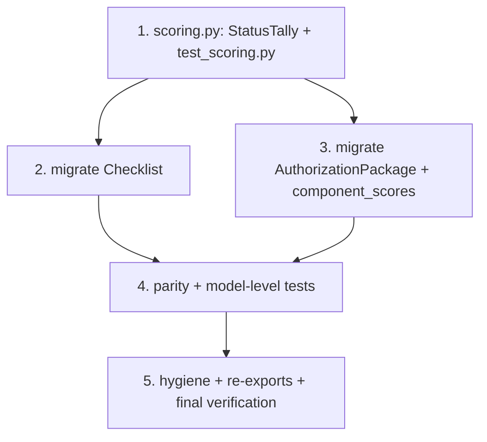

# Implementation Plan

## Overview

Incremental, test-driven deepening of the duplicated RMF scoring math behind one
`StatusTally` value object. The sequence is: define `StatusTally` + its direct
tests → migrate `Checklist` to delegate → migrate `AuthorizationPackage` (four
metrics + `component_scores`) to delegate → lock serialization parity and add
model-level tests → hygiene / re-exports. Every step keeps the existing
`tests/test_system_assessment.py` scoring tests green and lands with
`.venv/bin/python -m pytest -q`.

Grounding note: `StatusTally` is a pure internal helper (frozen `dataclass`, not a
Pydantic model, never serialized). The `@computed_field` names and their
`model_dump()` values stay byte-identical — this is a behavior-preserving
refactor, not a schema change. Re-read the current code each task (a separate
`concentrate-shared-rules` spec may independently touch a `cat_for(severity)`
helper; this spec relies only on results already exposing `.cat`).

## Task Dependency Graph



```json
{
  "waves": [
    { "wave": 1, "tasks": ["1"] },
    { "wave": 2, "tasks": ["2", "3"] },
    { "wave": 3, "tasks": ["4"] },
    { "wave": 4, "tasks": ["5"] }
  ]
}
```

## Tasks

- [ ] 1. Create `network_models/system/scoring.py` with `StatusTally` and its direct tests
  - Add module `network_models/system/scoring.py` with `from __future__ import
    annotations`; import only stdlib (`dataclasses`, `typing`, and later
    `itertools` is used by callers, not here) plus `CHECKLIST_STATUSES` from
    `network_models.system.vocab`. Do NOT import Pydantic (design §2.1).
  - Define `seed_status_counts()` — the single seed helper replacing the three
    `{s: 0 for s in CHECKLIST_STATUSES}` literals.
  - Define the frozen dataclass `StatusTally` with fields `status_counts`,
    `cat_open_counts`; classmethods `from_results(results)` and
    `from_status_pairs(pairs)`; `__add__`; and properties `total`,
    `compliance_score`, `coverage`. Encode the RMF conventions once: `assessable =
    total − Not_Applicable`, empty→`100.0`, `Not_Reviewed` in denominator,
    `round(..., 1)`; seed status in `CHECKLIST_STATUSES` order; `cat_open_counts`
    first-seen order, `Open`-only, `cat or "unknown"`.
  - Add `__all__ = ["StatusTally", "seed_status_counts"]`.
  - Create `tests/test_scoring.py`: empty → 100.0; all `Not_Applicable` → 100.0;
    mixed statuses reproduce assessable/Not_Reviewed/rounding; `cat_open_counts`
    grouping + omission of zero labels + `unknown` bucket; `__add__` equals the
    concatenated tally; `from_results` agrees with `from_status_pairs`.
  - _Requirements: 1.1, 1.2, 1.3, 1.4, 1.5, 1.6, 2.1, 2.2, 2.3, 2.4, 2.5, 2.6, 2.7, 2.8, 8.1, 8.2, 8.3, 8.4, 8.5, 8.6, 10.1, 10.2, 10.4_ (design §2.1, §2.4)

- [ ] 2. Migrate `Checklist` to delegate to `StatusTally` (`network_models/system/assessment.py`)
  - Add `from network_models.system.scoring import StatusTally`.
  - Replace the bodies of `status_counts`, `cat_open_counts`, `compliance_score`,
    and `coverage` with one-line delegations to
    `StatusTally.from_results(self.results)`, keeping each a `@computed_field`
    `@property` with its exact current name and docstring intent.
  - Remove the now-inline RMF math and the `{s: 0 for s in CHECKLIST_STATUSES}`
    seed; drop the `CHECKLIST_STATUSES` import from this module if it becomes
    unused. Leave `RuleResult` (incl. `.cat`) and `_unique_rule_ids` untouched.
  - Confirm the existing `test_checklist_scoring` still passes unchanged.
  - _Requirements: 3.1, 3.2, 3.3, 3.4, 7.2, 7.3, 10.4_ (design §2.2)

- [ ] 3. Migrate `AuthorizationPackage` scoring + `component_scores` (`network_models/system/authorization.py`)
  - Add `from itertools import chain` and `from network_models.system.scoring
    import StatusTally`.
  - Add a private `_system_tally()` building
    `StatusTally.from_results(chain.from_iterable(cl.results for cl in
    self.checklists))`; delegate the four `@computed_field`s (`status_counts`,
    `cat_open_counts`, `compliance_score`, `coverage`) to it. Keep them
    `@computed_field`s with unchanged names.
  - Rewrite `component_scores` to fold per-checklist tallies via `__add__`,
    keying `cl.component or "__system__"`, returning `{key: tally.status_counts}`;
    keep it a plain method (NOT a `@computed_field`).
  - Remove the inline seed/aggregation and drop the `CHECKLIST_STATUSES` import if
    unused. Leave `rolled_up_control_status`, `draft_poam_from_findings`,
    `Categorization`, and `_unique_ids` untouched.
  - Confirm the existing `test_system_wide_scoring_matches_single_checklist`
    passes unchanged.
  - _Requirements: 4.1, 4.2, 4.3, 4.4, 4.5, 5.1, 5.2, 5.3, 7.2, 7.3, 10.4_ (design §2.3)

- [ ] 4. Lock serialization parity and add model-level tests (`tests/test_system_assessment.py`)
  - Keep the existing `test_checklist_scoring`,
    `test_system_wide_scoring_matches_single_checklist`, and
    `test_scores_serialize_and_roundtrip` as the pre-refactor characterization
    baseline — they must stay green with no edits.
  - Add golden-parity assertions: capture the full `model_dump(mode="json")` for a
    representative `Checklist` and `AuthorizationPackage` (mixed statuses,
    multiple CAT labels) and assert it equals a committed expected dict, including
    the `@computed_field` key set, `status_counts` (`CHECKLIST_STATUSES` order),
    and `cat_open_counts` (first-seen order). Assert `model_validate(dump)`
    round-trips via `ComputedFieldModel`.
  - Add model-level cases: empty `Checklist` → `compliance_score == coverage ==
    100.0`; all `Not_Applicable` `Checklist`; a mixed multi-checklist
    `AuthorizationPackage` whose system-wide numbers equal the flattened tally;
    `component_scores` keys `{comp_a, comp_b, "__system__"}` (system-level
    checklist has `component=None`) with the expected per-key counts.
  - _Requirements: 5.1, 5.2, 5.3, 6.1, 6.2, 6.3, 6.4, 6.5, 9.1, 9.2, 9.3, 9.4, 9.5_ (design §2.4)

- [ ] 5. Hygiene, re-exports, and final verification
  - Confirm `scoring.py` `__all__` lists `StatusTally` (and `seed_status_counts`);
    keep `StatusTally` an internal seam importable from
    `network_models.system.scoring`. Optionally surface it through
    `system/__init__.py`'s re-export, but do NOT add it to the top-level public
    model surface (it is a helper, not a schema model) — the public model surface
    stays untouched.
  - Verify no import cycle (`scoring.py` imports neither `assessment.py` nor
    `authorization.py`) and no new third-party dependency was introduced.
  - Run the full suite: `.venv/bin/python -m pytest -q` — all pass. Grep for any
    remaining `{s: 0 for s in CHECKLIST_STATUSES}` occurrences to confirm the seed
    now lives only in `scoring.py`.
  - _Requirements: 7.1, 7.4, 10.1, 10.2, 10.3, 10.4_

## Notes

- **Behavior-preserving refactor.** No public model field or `@computed_field`
  name changes. The four metric names and their emitted values stay identical;
  parity is asserted, not assumed (task 4).
- **Portability.** `network_models/` stays pydantic + stdlib only. `StatusTally`
  imports *no* Pydantic (`dataclasses` + `typing` + `CHECKLIST_STATUSES`), so no
  new dependency is added and the package can still be vendored unchanged.
- **Cross-spec note.** A separate `concentrate-shared-rules` spec may introduce a
  shared `cat_for(severity)` helper the tally could later lean on. The specs are
  independent: this tally relies only on results already exposing `.cat`, so it
  needs no change if that helper lands. Re-read the current code at the start of
  each task.
- **Existing coverage.** `tests/test_system_assessment.py` already spot-checks
  scoring (`test_checklist_scoring`,
  `test_system_wide_scoring_matches_single_checklist`,
  `test_scores_serialize_and_roundtrip`). These are the golden baseline; this spec
  broadens coverage with a direct `tests/test_scoring.py` and fuller model-level +
  byte-parity assertions. If preferred, write the golden model-dump test *before*
  tasks 2–3 so it characterizes the pre-refactor output, then keep it green.
- **Run commands.** `.venv/bin/python -m pytest -q` for the suite;
  `.venv/bin/python -m pytest tests/test_scoring.py -q` for the direct tally tests.
</content>
