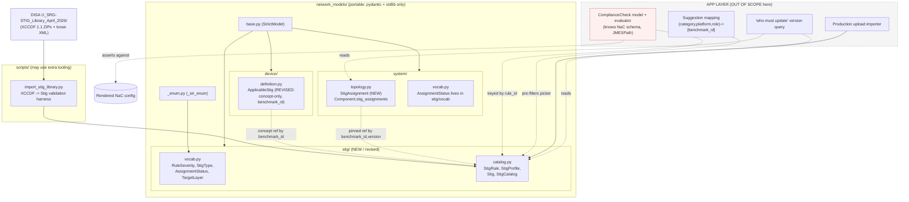
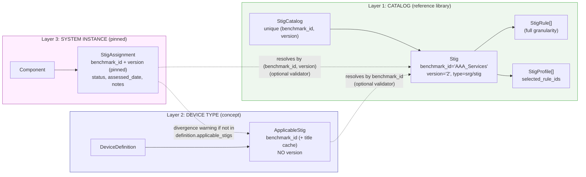
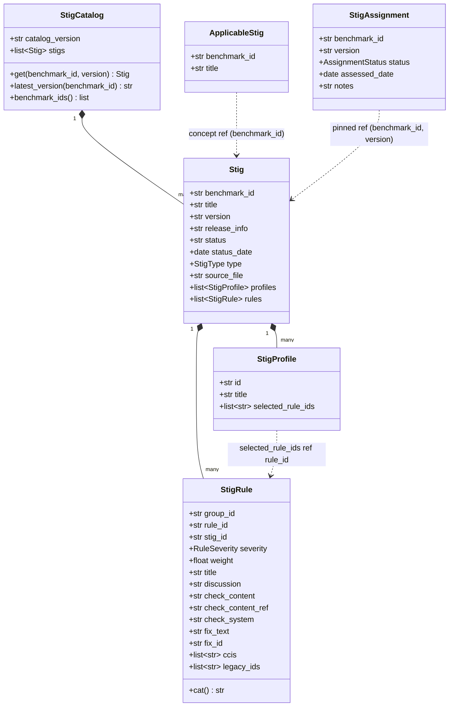

# Design Document: stig-catalog

## Overview

This feature adds first-class **STIG (Security Technical Implementation Guide)**
support to the portable `network_models` package so a web app can (1) let users
select the STIGs that apply to a device type, (2) pin specific STIG versions to
deployed device instances and track their assessment status, and (3) — as a
downstream goal owned by a separate app layer — prove that a generated Cisco
Network-as-Code (NaC) config satisfies a STIG's rules.

The design is organized around **three layers of STIG reference**, deliberately
kept at different granularities so each layer stays honest about what it actually
knows:

1. **Catalog** (`network_models/stig/`) — the reference library of STIGs and SRGs,
   modeled to full rule granularity, derived verbatim from DISA XCCDF benchmark
   content. Identity is `(benchmark_id, version)`.
2. **Device concept-reference** (`network_models/device/definition.py`) — a device
   *type* declares which STIGs apply *by concept* (`benchmark_id` only, no version).
   "This switch type is subject to the IOS-XE NDM STIG."
3. **System pinned-assignment** (`network_models/system/`) — a deployed *component*
   pins a concrete `(benchmark_id, version)` and records an assessment `status`.
   Instances may legitimately deviate from their type's declared set.

Everything in this spec lives inside the portable package (pydantic + stdlib only)
plus one thin validation-harness script. The config-compliance evaluator, the
picker suggestion mapping, the production upload importer, and the "which devices
must update" query are **app-layer and out of scope here**; their contracts are
documented so the boundary is explicit.

---

## Scope Boundary (read this first)

| Concern | In scope (this repo) | Out of scope (app layer) | Rationale |
|---|---|---|---|
| Catalog schema (`Stig`, `StigProfile`, `StigRule`, `StigCatalog`) | ✅ models in `network_models/stig/` | — | Portable reference data |
| Device concept-ref (`ApplicableStig`) | ✅ revised in `device/definition.py` | — | Version-agnostic "applies to type" |
| System pinned-assignment (`StigAssignment` on `Component`) | ✅ new in `system/topology.py` | — | Per-instance pinned version + status |
| Optional catalog-resolver validators | ✅ on `DeviceDefinition` (opt-in) | — | Mirrors `_switchport_vlans_defined` |
| Validation harness / integration test | ✅ `scripts/import_stig_library.py` | — | Mirrors `import_devicetype_library.py` |
| `ComplianceCheck` model + evaluator | ❌ | ✅ owns NaC-schema knowledge, JMESPath | Would break the portability boundary |
| Suggestion mapping `(category, platform, role?) -> [benchmark_id]` | ❌ | ✅ curated JSON/YAML, hand-seeded | Curated data, not a schema |
| Production upload/ingest importer | ❌ | ✅ users upload via web app | App-owned workflow |
| "Which devices must update on version bump" query | ❌ | ✅ compares assignment.version to catalog latest | A query, not schema state |

**Portability boundary (hard rule):** `network_models/` imports only `pydantic` and
the standard library. `ComplianceCheck` asserts against *rendered NaC config paths*
(e.g. JMESPath into a NaC document), which would couple the package to the NaC
schema — so it and its evaluator live outside the package. The catalog models
carry no expected-config expressions.

---

# Part 1 — High-Level Design

## Architecture



## The three-layer linkage



**Why three granularities:**

- The **catalog** is the only place that knows rule bodies. It is versioned because
  rule content changes release to release.
- The **device type** answers "what applies to this kind of box?" — a stable,
  version-agnostic fact. Pinning a version at the type level would force every
  device library entry to churn on each STIG release, so version is deliberately
  *not* here. (This reverses an earlier `(benchmark_id, version)` device-uniqueness
  decision: version has moved down to the instance layer.)
- The **system instance** is where a real, assessable version gets pinned and a
  status is tracked. Two components built from the same definition may sit at
  different STIG versions (staggered patching), which is why assignments are listed
  explicitly rather than computed from the definition.

## Data Models



## Components and Interfaces

### Catalog subpackage (`network_models/stig/`)

- **Purpose:** hold the reference library and vocab.
- **Interface:** `StigCatalog.get(benchmark_id, version=None)`,
  `StigCatalog.latest_version(benchmark_id)`, `Stig.severity_counts`,
  `StigRule.cat`. All read-only derived views; no mutation, no I/O.
- **Responsibilities:** faithful representation of XCCDF content; catalog
  uniqueness on `(benchmark_id, version)`; intra-STIG rule-id uniqueness; profile
  `selected_rule_ids` resolve to rules within the same STIG.

### Device concept-reference (`network_models/device/definition.py`)

- **Purpose:** declare applicable STIGs on a device *type*, version-agnostic.
- **Interface:** `ApplicableStig{benchmark_id, title?}`; `DeviceDefinition` gains an
  optional `validate_against_catalog(catalog)` path (opt-in resolver).
- **Responsibilities:** benchmark_id uniqueness (version removed); optionally
  resolve every `benchmark_id` against a supplied catalog.

### System pinned-assignment (`network_models/system/topology.py`)

- **Purpose:** pin STIG versions and status to deployed components.
- **Interface:** `Component.stig_assignments: list[StigAssignment]`; optional
  `System.validate_against_catalog(catalog)` and divergence warnings.
- **Responsibilities:** `(benchmark_id, version)` uniqueness per component; status
  vocabulary enforcement; optional catalog resolution and definition-divergence
  warnings.

### Validation harness (`scripts/import_stig_library.py`)

- **Purpose:** integration test — parse the local DISA bundle and validate every
  benchmark against the models; optionally emit per-benchmark JSON.
- **Interface:** CLI, mirroring `import_devicetype_library.py`.
- **Responsibilities:** stdlib-only XCCDF/ZIP parsing; pass/fail summary grouped by
  error cause; `--out` writes `<benchmark_id>_<version>.json` + `catalog_manifest.json`.

## Error Handling

| Scenario | Condition | Response | Recovery |
|---|---|---|---|
| Duplicate catalog entry | two STIGs share `(benchmark_id, version)` | `ValidationError` at `StigCatalog` | dedupe input |
| Duplicate rule id | two rules share `rule_id`/`group_id` within a STIG | `ValidationError` at `Stig` | fix source parse |
| Dangling profile ref | `selected_rule_ids` names a missing rule | `ValidationError` at `Stig` | correct profile/rules |
| Unknown severity | XCCDF `@severity` outside vocab | `ValidationError` at `StigRule` | add value to `RULE_SEVERITIES` (one-line) |
| Unresolved applicable STIG | `benchmark_id` not in supplied catalog | `ValidationError` only when catalog passed | fix id or omit catalog |
| Assignment not in definition | component pins a STIG its type doesn't declare | **warning**, never rejected | intentional deviation allowed |
| Malformed XCCDF | parse error in harness | file recorded in failure summary, non-zero exit | fix/skip that file |

## Testing Strategy

- **Unit / example (pytest, following `tests/test_models.py`):** catalog uniqueness;
  severity enum + derived CAT property; profile ref resolution; migrated device STIG
  tests; `StigAssignment` uniqueness/status; same-benchmark-different-version at the
  component layer; optional resolver behavior (validates standalone, rejects on
  unresolved id only when catalog supplied).
- **Property-based (optional, `hypothesis` if adopted in `test` extra):** the
  correctness properties in Part 2 §"Correctness Properties" — round-trip fidelity,
  uniqueness invariants, CAT-mapping totality, resolver monotonicity.
- **Integration:** `scripts/import_stig_library.py` run against the real
  `U_SRG-STIG_Library_April_2026/` bundle (188 entries + loose XML) must validate
  100% or report grouped causes.

## Security / Performance Considerations

- **Content is untrusted text.** XCCDF discussion/check/fix bodies are stored as
  opaque strings; no HTML is rendered or executed by the models. The web app is
  responsible for escaping on display.
- **No secrets.** Catalog data is public DISA content.
- **Per-benchmark JSON, not one catalog.json.** `--out` writes one file per
  `(benchmark_id, version)` so the picker can lazy-load and diffs stay reviewable.
  A `catalog_manifest.json` index (id, version, type, title, rule_count, source_file)
  drives fast picker population without loading rule bodies.

## Dependencies

- Runtime (package): `pydantic >= 2.5`, Python stdlib (`datetime`, `typing`).
- Harness (`scripts/`): stdlib `zipfile`, `xml.etree.ElementTree`, `argparse`,
  `json`, `pathlib`, `html` (for unescaping). No third-party XML libs.
- `.gitignore`: add `stig_catalog/` (harness `--out` destination).

---

# Part 2 — Low-Level Design

Notation: Python (Pydantic v2), matching the repo. All models inherit `StrictModel`
(`extra="forbid"`, strip whitespace, validate on assignment). All modules use
`from __future__ import annotations`. Constrained strings are `_str_enum` values
from verbatim lists in `vocab.py`. Support floor is Python 3.10 (no `enum.StrEnum`).

## 2.1 `network_models/stig/vocab.py` (revised)

```python
"""Vocabularies for the STIG catalog domain.

Values mirror DISA XCCDF 1.1 benchmark content verbatim so the importer maps
fields byte-for-byte. Keep every value list as the single, auditable source of
truth; adding a value is a one-line change.
"""

from __future__ import annotations

from network_models._enum import _str_enum

STIG_SCHEMA_VERSION = "0.1-draft"

# XCCDF Rule/@severity -> DISA CAT level:
#   high = CAT I, medium = CAT II, low = CAT III. "unknown" is the XCCDF default.
RULE_SEVERITIES = ["high", "medium", "low", "unknown"]
SEVERITY_TO_CAT = {"high": "CAT I", "medium": "CAT II", "low": "CAT III"}

# Whether a catalog entry is a Security Requirements Guide (technology-agnostic,
# lineage only) or a STIG (concrete, selectable/assignable in the picker).
STIG_TYPES = ["srg", "stig"]

# Per-component assessment status of a pinned STIG assignment.
#   inherited_pending = applies via inheritance/overlay but not yet assessed here.
ASSIGNMENT_STATUSES = [
    "not_assessed",
    "compliant",
    "open",
    "not_applicable",
    "inherited_pending",
]

# Where a (future, app-layer) ComplianceCheck asserts. Kept here so the vocabulary
# is shared, even though ComplianceCheck itself is out of scope for this package.
#   nac_config = assert against the rendered Cisco NaC document (primary surface)
#   model      = assert against the network_models instances (alternative)
TARGET_LAYERS = ["nac_config", "model"]

RuleSeverity = _str_enum("RuleSeverity", RULE_SEVERITIES)
StigType = _str_enum("StigType", STIG_TYPES)
AssignmentStatus = _str_enum("AssignmentStatus", ASSIGNMENT_STATUSES)
TargetLayer = _str_enum("TargetLayer", TARGET_LAYERS)

__all__ = [
    "STIG_SCHEMA_VERSION",
    "RULE_SEVERITIES", "SEVERITY_TO_CAT", "STIG_TYPES",
    "ASSIGNMENT_STATUSES", "TARGET_LAYERS",
    "RuleSeverity", "StigType", "AssignmentStatus", "TargetLayer",
]
```

> `AssignmentStatus` and `TargetLayer` live in `stig/vocab.py` (the STIG domain owns
> the vocabulary). `system/topology.py` imports `AssignmentStatus` from
> `network_models.stig.vocab`, which is allowed — both are inside the portable package.

## 2.2 `network_models/stig/catalog.py` (revised — full rule granularity)

```python
"""STIG catalog models: the reference library of SRGs/STIGs and their rules.

Reference data derived from the DISA SRG-STIG Library (XCCDF 1.1 benchmark
content). Modeled down to individual rules because the end goal is proving a
generated config satisfies a STIG. Identity is versionless ``benchmark_id`` plus a
separate ``version``; catalog uniqueness is ``(benchmark_id, version)``.

Portability: pydantic + stdlib only. No expected-config / NaC coupling here — that
is the app-layer ComplianceCheck's job (see design Scope Boundary).
"""

from __future__ import annotations

from datetime import date
from typing import Optional

from pydantic import Field, field_validator, model_validator

from network_models.base import StrictModel
from network_models.stig.vocab import SEVERITY_TO_CAT, RuleSeverity, StigType


class StigRule(StrictModel):
    """A single STIG rule = one XCCDF <Group>/<Rule> pair, metadata-faithful.

    Identifier conventions (DISA/XCCDF):
      * group_id — Vuln ID from Group/@id, e.g. 'V-204636'
      * rule_id  — Rule ID from Rule/@id,  e.g. 'SV-204636r1043176_rule'
      * stig_id  — STIG-ID from Rule/<version>, e.g. 'SRG-APP-000023-AAA-000030'
    """

    group_id: str = Field(..., min_length=1, description="Vuln ID, e.g. 'V-204636'")
    rule_id: str = Field(..., min_length=1, description="Rule ID, e.g. 'SV-204636r1043176_rule'")
    stig_id: Optional[str] = Field(None, description="Rule <version> / STIG-ID")
    severity: RuleSeverity                       # verbatim XCCDF @severity
    weight: Optional[float] = Field(None, ge=0, allow_inf_nan=False, description="Rule/@weight")
    title: str = Field(..., min_length=1)
    discussion: Optional[str] = Field(
        None, description="Best-effort text from <VulnDiscussion>; raw <description> fallback"
    )
    check_content: Optional[str] = Field(None, description="<check>/<check-content> text")
    check_content_ref: Optional[str] = Field(
        None, description="<check-content-ref @name or @href>"
    )
    check_system: Optional[str] = Field(None, description="<check @system>")
    fix_text: Optional[str] = Field(None, description="<fixtext> remediation text")
    fix_id: Optional[str] = Field(None, description="<fix @id> / <fixtext @fixref>")
    ccis: list[str] = Field(
        default_factory=list, description="ident system=.../cci, e.g. 'CCI-000015'"
    )
    legacy_ids: list[str] = Field(
        default_factory=list, description="ident system=.../legacy, e.g. 'V-80819'"
    )

    @property
    def cat(self) -> Optional[str]:
        """DISA CAT label (CAT I/II/III) derived from severity; None if unknown."""
        return SEVERITY_TO_CAT.get(str(self.severity))

    @field_validator("ccis", "legacy_ids")
    @classmethod
    def _unique_idents(cls, v: list[str]) -> list[str]:
        if len(v) != len(set(v)):
            raise ValueError("duplicate identifier in rule")
        return v


class StigProfile(StrictModel):
    """An XCCDF <Profile> (e.g. a MAC level): a named selection of rules.

    Stores only rule-id references — NOT rule bodies — to avoid JSON bloat, since
    profiles overlap heavily. selected_rule_ids reference StigRule.rule_id within
    the SAME Stig.
    """

    id: str = Field(..., min_length=1, description="Profile/@id, e.g. 'MAC-1_Classified'")
    title: Optional[str] = None
    selected_rule_ids: list[str] = Field(default_factory=list)

    @field_validator("selected_rule_ids")
    @classmethod
    def _unique_selection(cls, v: list[str]) -> list[str]:
        if len(v) != len(set(v)):
            raise ValueError("duplicate rule id in profile selection")
        return v


class Stig(StrictModel):
    """A single benchmark (SRG or STIG) at a specific version, with its rules."""

    benchmark_id: str = Field(
        ..., min_length=1, description="XCCDF Benchmark/@id VERBATIM, e.g. 'AAA_Services'"
    )
    title: str = Field(..., min_length=1)
    version: str = Field(..., min_length=1, description="XCCDF <version> VERBATIM, e.g. '2'")
    release_info: Optional[str] = Field(
        None, description="plain-text release-info verbatim, e.g. 'Release: 2 Benchmark Date: 30 Jan 2025'"
    )
    status: Optional[str] = Field(None, description="<status> text, e.g. 'accepted'")
    status_date: Optional[date] = Field(None, description="<status @date>")
    type: StigType = Field(..., description="srg | stig; only stig is picker-selectable")
    source_file: str = Field(
        ..., min_length=1, description="Original source filename VERBATIM (traceability)"
    )
    profiles: list[StigProfile] = Field(default_factory=list)
    rules: list[StigRule] = Field(default_factory=list)

    @property
    def severity_counts(self) -> dict[str, int]:
        """Rule counts by CAT label (selector/summary display)."""
        counts: dict[str, int] = {}
        for r in self.rules:
            counts[r.cat or "unknown"] = counts.get(r.cat or "unknown", 0) + 1
        return counts

    @model_validator(mode="after")
    def _unique_rule_ids(self) -> "Stig":
        rule_ids = [r.rule_id for r in self.rules]
        if len(rule_ids) != len(set(rule_ids)):
            raise ValueError("duplicate rule_id within a STIG")
        group_ids = [r.group_id for r in self.rules]
        if len(group_ids) != len(set(group_ids)):
            raise ValueError("duplicate group_id (Vuln ID) within a STIG")
        return self

    @model_validator(mode="after")
    def _profiles_resolve(self) -> "Stig":
        """Every profile selection must reference a rule that exists in this STIG."""
        known = {r.rule_id for r in self.rules}
        for p in self.profiles:
            missing = [rid for rid in p.selected_rule_ids if rid not in known]
            if missing:
                raise ValueError(
                    f"profile '{p.id}' selects unknown rule id(s): {missing[:5]}"
                )
        return self

    @model_validator(mode="after")
    def _unique_profile_ids(self) -> "Stig":
        ids = [p.id for p in self.profiles]
        if len(ids) != len(set(ids)):
            raise ValueError("duplicate profile id within a STIG")
        return self


class StigCatalog(StrictModel):
    """The reference library the web app selects from.

    Uniqueness is on (benchmark_id, version) — the same benchmark may appear at
    multiple versions, matching the pinning key used for Component assignments.
    """

    catalog_version: str = Field(
        ..., min_length=1, description="Catalog build id, e.g. 'April_2026'"
    )
    stigs: list[Stig] = Field(default_factory=list)

    @model_validator(mode="after")
    def _unique_benchmark_version(self) -> "StigCatalog":
        keys = [(s.benchmark_id, s.version) for s in self.stigs]
        if len(keys) != len(set(keys)):
            raise ValueError("duplicate (benchmark_id, version) in catalog")
        return self

    # --- read-only lookups (no I/O, no mutation) ---
    def get(self, benchmark_id: str, version: Optional[str] = None) -> Optional[Stig]:
        """Look up a STIG by benchmark id, optionally pinned to a version.

        With no version, returns the first match (useful for the device-type
        *concept* reference, which is version-agnostic).
        """
        for s in self.stigs:
            if s.benchmark_id == benchmark_id and (version is None or s.version == version):
                return s
        return None

    def versions(self, benchmark_id: str) -> list[str]:
        """All versions present for a benchmark id, in catalog order."""
        return [s.version for s in self.stigs if s.benchmark_id == benchmark_id]

    def latest_version(self, benchmark_id: str) -> Optional[str]:
        """Most recent version for a benchmark, by status_date then insertion order.

        NOTE: version strings are heterogeneous ('2', 'V2R9', 'V5R3'); we do NOT
        parse them. We rank by status_date when available, else last-seen wins.
        The app-layer 'who must update' query builds on this.
        """
        candidates = [s for s in self.stigs if s.benchmark_id == benchmark_id]
        if not candidates:
            return None
        dated = [s for s in candidates if s.status_date is not None]
        if dated:
            return max(dated, key=lambda s: s.status_date).version
        return candidates[-1].version

    def benchmark_ids(self, type: Optional[str] = None) -> list[str]:
        """Distinct benchmark ids, optionally filtered by type ('srg'|'stig')."""
        seen: dict[str, None] = {}
        for s in self.stigs:
            if type is None or str(s.type) == type:
                seen.setdefault(s.benchmark_id, None)
        return list(seen)


__all__ = ["StigRule", "StigProfile", "Stig", "StigCatalog"]
```

## 2.3 `network_models/device/definition.py` — revised `ApplicableStig`

Concept-only: `version` **removed** (moves to the component layer); uniqueness
reverts to `benchmark_id` alone; an **optional** catalog resolver is added.

```python
class ApplicableStig(StrictModel):
    """A STIG that applies to this device *type*, referenced by concept.

    Version-agnostic on purpose: a device type is subject to a benchmark
    regardless of which release is current. The concrete version is pinned at the
    deployed-component layer (system.StigAssignment). `title` is an optional
    denormalized display cache so a picker can render without loading the catalog.
    """

    benchmark_id: str = Field(..., min_length=1)
    title: Optional[str] = None
```

`DeviceDefinition` validator changes:

```python
    @model_validator(mode="after")
    def _unique_applicable_stigs(self) -> "DeviceDefinition":
        # Uniqueness reverts to benchmark_id alone (version now lives on the
        # deployed Component's StigAssignment, not on the device *type*).
        ids = [s.benchmark_id for s in self.applicable_stigs]
        if len(ids) != len(set(ids)):
            raise ValueError("duplicate benchmark_id in applicable_stigs")
        return self
```

Optional catalog resolver (NOT a `model_validator`; explicit opt-in method so
definitions validate standalone — the gitignored `converted/` library has empty
`applicable_stigs` and must still load). Mirrors the `_switchport_vlans_defined`
"only enforce when data provided" pattern:

```python
    def validate_against_catalog(self, catalog: "StigCatalog") -> "DeviceDefinition":
        """Assert every applicable STIG resolves to a catalog benchmark_id.

        Opt-in: call explicitly when a catalog is available. Standalone validation
        (no catalog) never requires resolution, so device libraries with empty or
        unresolved applicable_stigs still load. Returns self for chaining.
        """
        known = set(catalog.benchmark_ids())
        missing = [s.benchmark_id for s in self.applicable_stigs if s.benchmark_id not in known]
        if missing:
            raise ValueError(f"applicable_stigs do not resolve in catalog: {missing}")
        return self
```

> `StigCatalog` is imported lazily inside the method (or under `TYPE_CHECKING`) to
> keep import direction clean; both modules are in the portable package so there is
> no portability violation.

## 2.4 `network_models/system/topology.py` — new `StigAssignment`

```python
from network_models.stig.vocab import AssignmentStatus  # portable-internal import


class StigAssignment(StrictModel):
    """A STIG pinned to a deployed component at a concrete version, with status.

    Listed explicitly on the component (NOT auto-derived from the device
    definition) so an instance may legitimately deviate — e.g. sit one release
    behind, or carry a STIG its type doesn't declare. Per-rule findings are NOT
    stored here; that is the app-layer ComplianceCheck evaluator's output.
    """

    benchmark_id: str = Field(..., min_length=1, description="Join key to StigCatalog")
    version: str = Field(..., min_length=1, description="Pinned release, e.g. 'V5R3'")
    status: AssignmentStatus = AssignmentStatus("not_assessed")
    assessed_date: Optional[date] = None
    notes: Optional[str] = None
```

`Component` gains the field and a per-component uniqueness validator:

```python
class Component(StrictModel):
    # ... existing fields ...
    stig_assignments: list[StigAssignment] = Field(default_factory=list)

    @model_validator(mode="after")
    def _unique_stig_assignments(self) -> "Component":
        keys = [(a.benchmark_id, a.version) for a in self.stig_assignments]
        if len(keys) != len(set(keys)):
            raise ValueError("duplicate (benchmark_id, version) in stig_assignments")
        return self
```

Optional, system-level catalog resolver + definition-divergence **warning**
(opt-in methods; not `model_validator`s, so a `System` validates standalone):

```python
    # on System
    def validate_stig_assignments(self, catalog: "StigCatalog") -> "System":
        """Assert every component's assignments resolve to a catalog (benchmark_id, version)."""
        for c in self.components:
            for a in c.stig_assignments:
                if catalog.get(a.benchmark_id, a.version) is None:
                    raise ValueError(
                        f"component '{c.id}' pins unresolved STIG "
                        f"({a.benchmark_id}, {a.version})"
                    )
        return self

    def stig_divergences(
        self, definitions: "DeviceDefinitionLibrary"
    ) -> list[tuple[str, str]]:
        """Return (component_id, benchmark_id) pairs a component assigns but its
        device definition does not declare. WARN-only: never raises. Empty list
        means every assignment is backed by the type's applicable_stigs.
        """
        by_slug = {d.slug: d for d in definitions.definitions}
        out: list[tuple[str, str]] = []
        for c in self.components:
            d = by_slug.get(c.device_definition) if c.device_definition else None
            declared = {s.benchmark_id for s in d.applicable_stigs} if d else set()
            for a in c.stig_assignments:
                if a.benchmark_id not in declared:
                    out.append((c.id, a.benchmark_id))
        return out
```

`StigAssignment` is added to `system/topology.py`'s `__all__`, flowing through the
top-level re-export.

## 2.5 XCCDF parsing algorithm (harness) — pseudocode

The harness uses stdlib `zipfile` + `xml.etree.ElementTree` only. XCCDF 1.1
namespace is `http://checklists.nist.gov/xccdf/1.1`.

```pascal
ALGORITHM ImportStigLibrary(source_path, out_dir?)
INPUT:  source_path (a directory of ZIPs, a single *.zip, or a loose *-xccdf.xml)
OUTPUT: exit_code; optional per-benchmark JSON + catalog_manifest.json

BEGIN
    xccdf_docs <- COLLECT_XCCDF(source_path)      // (source_file, xml_bytes) pairs
    results   <- empty list
    manifest  <- empty list

    FOR each (source_file, xml_bytes) IN xccdf_docs DO
        TRY
            stig <- PARSE_BENCHMARK(xml_bytes, source_file)   // -> Stig(**kwargs)
            results.add(PASS, stig)
            IF out_dir provided THEN
                WRITE out_dir/(stig.benchmark_id + "_" + stig.version + ".json")
                manifest.add({benchmark_id, version, type, title,
                              rule_count = len(stig.rules), source_file})
            END IF
        CATCH ValidationError e
            results.add(FAIL, first_error_group(e), source_file)   // group by cause
        CATCH ParseError e
            results.add(LOAD_ERROR, source_file, e)
        END TRY
    END FOR

    IF out_dir provided THEN WRITE out_dir/"catalog_manifest.json" <- manifest
    PRINT summary grouped by error cause (mirror import_devicetype_library.py)
    RETURN 0 IF no failures AND no load errors ELSE 1
END


ALGORITHM COLLECT_XCCDF(path)
BEGIN
    IF path is a loose *.xml THEN RETURN [(path.name, read_bytes(path))]
    docs <- empty list
    FOR each zip_file IN find_zips(path) DO         // recurse dir; accept single zip
        OPEN zip_file WITH zipfile
        FOR each member IN zip WHERE member endswith "-xccdf.xml" DO
            docs.add((zip_file.name, zip.read(member)))   // source_file = outer zip name
        END FOR
    END FOR
    // Also sweep any loose *-xccdf.xml directly under path
    FOR each xml IN glob(path, "*-xccdf.xml") DO docs.add((xml.name, read_bytes(xml))) END FOR
    RETURN docs
END


ALGORITHM PARSE_BENCHMARK(xml_bytes, source_file)
INPUT:  raw XCCDF 1.1 bytes
OUTPUT: a validated Stig
PRECONDITION:  root element is {ns}Benchmark
POSTCONDITION: returned Stig has unique rule_ids; profiles resolve
BEGIN
    root  <- ET.fromstring(xml_bytes)
    ns    <- "{http://checklists.nist.gov/xccdf/1.1}"

    benchmark_id <- root.get("id")                         // VERBATIM
    title        <- text(root.find(ns+"title"))
    version      <- text(root.find(ns+"version"))          // VERBATIM, e.g. "2"
    status_el    <- root.find(ns+"status")
    status       <- text(status_el);  status_date <- status_el.get("date")
    release_info <- text(plain_text_with_id(root, "release-info"))
    type         <- CLASSIFY_TYPE(benchmark_id, title, source_file)   // srg | stig

    profiles <- empty list
    FOR each P IN root.findall(ns+"Profile") DO
        selected <- [ sel.get("idref") FOR sel IN P.findall(ns+"select")
                        WHERE sel.get("selected") == "true" ]
        // NOTE: XCCDF <select idref> points at Group @id (V-ids). Normalize to
        // rule_id by mapping each Group's V-id to its child Rule @id during the
        // rule pass, so StigProfile.selected_rule_ids resolves against rule_ids.
        profiles.add(StigProfile(id=P.get("id"), title=text(P.find(ns+"title")),
                                 selected_rule_ids=selected))   // remapped below
    END FOR

    rules <- empty list
    group_to_rule <- empty map
    FOR each G IN root.findall(ns+"Group") DO
        group_id <- G.get("id")                            // V-204636
        R <- G.find(ns+"Rule")
        rule_id  <- R.get("id")                            // SV-...r..._rule
        group_to_rule[group_id] <- rule_id
        raw_desc <- text(R.find(ns+"description"))
        rules.add(StigRule(
            group_id          = group_id,
            rule_id           = rule_id,
            stig_id           = text(R.find(ns+"version")),          // SRG-APP-...
            severity          = R.get("severity") or "unknown",     // verbatim
            weight            = to_float(R.get("weight")),
            title             = text(R.find(ns+"title")),
            discussion        = EXTRACT_VULN_DISCUSSION(raw_desc),   // fallback raw_desc
            check_content     = text(R.find(ns+"check/"+ns+"check-content")),
            check_content_ref = attr(R, ns+"check/"+ns+"check-content-ref", "name")
                                 OR attr(..., "href"),
            check_system      = attr(R.find(ns+"check"), "system"),
            fix_text          = text(R.find(ns+"fixtext")),
            fix_id            = attr(R.find(ns+"fix"), "id")
                                 OR attr(R.find(ns+"fixtext"), "fixref"),
            ccis       = [ text(i) FOR i IN R.findall(ns+"ident")
                             WHERE i.get("system") endswith "/cci" ],
            legacy_ids = [ text(i) FOR i IN R.findall(ns+"ident")
                             WHERE i.get("system") endswith "/legacy" ],
        ))
    END FOR

    // Remap profile selections from Group V-ids to Rule ids (dangling refs dropped
    // OR kept to trigger Stig._profiles_resolve — choose STRICT: keep & let it raise
    // so importer surfaces malformed benchmarks).
    FOR each p IN profiles DO
        p.selected_rule_ids <- [ group_to_rule.get(gid, gid) FOR gid IN p.selected_rule_ids ]
    END FOR

    RETURN Stig(benchmark_id=benchmark_id, title=title, version=version,
                release_info=release_info, status=status, status_date=status_date,
                type=type, source_file=source_file, profiles=profiles, rules=rules)
END


ALGORITHM EXTRACT_VULN_DISCUSSION(raw_description)
// XCCDF <description> is HTML-escaped and wraps text in <VulnDiscussion>...</...>.
BEGIN
    unescaped <- html.unescape(raw_description)
    IF "<VulnDiscussion>" IN unescaped THEN
        RETURN substring between "<VulnDiscussion>" and "</VulnDiscussion>"
    ELSE
        RETURN unescaped            // best-effort raw fallback
    END IF
END


ALGORITHM CLASSIFY_TYPE(benchmark_id, title, source_file)
// SRGs vs STIGs. DISA naming: SRGs say "Security Requirements Guide" / contain _SRG_;
// STIGs say "Security Technical Implementation Guide" / contain _STIG_.
BEGIN
    hay <- lower(benchmark_id + " " + title + " " + source_file)
    IF "srg" IN hay OR "security requirements guide" IN hay THEN RETURN "srg"
    RETURN "stig"
END
```

**Complexity:** O(N) in total XML size; one pass per benchmark, plus one profile
remap pass over selections. Memory is one benchmark at a time (stream per file),
so the 188-entry bundle never all sits in memory.

## 2.6 Validators summary

| Model | Validator | Kind | Rule |
|---|---|---|---|
| `StigRule` | `_unique_idents` | field (`ccis`,`legacy_ids`) | no dup identifiers |
| `StigProfile` | `_unique_selection` | field | no dup rule id in selection |
| `Stig` | `_unique_rule_ids` | model | unique `rule_id` and `group_id` |
| `Stig` | `_profiles_resolve` | model | selections reference existing rules |
| `Stig` | `_unique_profile_ids` | model | unique profile ids |
| `StigCatalog` | `_unique_benchmark_version` | model | unique `(benchmark_id, version)` |
| `DeviceDefinition` | `_unique_applicable_stigs` | model | unique `benchmark_id` (version removed) |
| `DeviceDefinition` | `validate_against_catalog` | opt-in method | resolve ids when catalog supplied |
| `Component` | `_unique_stig_assignments` | model | unique `(benchmark_id, version)` |
| `System` | `validate_stig_assignments` | opt-in method | resolve pinned assignments |
| `System` | `stig_divergences` | opt-in query | warn-only divergence report |

## Correctness Properties

(for property-based testing)

Stated as universally-quantified invariants; each is a candidate `hypothesis` test.

### Property 1: Catalog uniqueness is enforced
∀ catalog inputs: if two entries share `(benchmark_id, version)`, construction
raises `ValidationError`; otherwise it succeeds.
```python
# for any list of stigs, StigCatalog validates IFF (benchmark_id, version) keys are distinct
assert distinct(keys) == constructs_ok(StigCatalog, stigs)
```

### Property 2: JSON round-trip fidelity
∀ valid `Stig s`: `Stig.model_validate(s.model_dump(mode="json")) == s`
(rule order, ccis/legacy_ids order, profiles preserved; no field loss).

### Property 3: CAT mapping totality and agreement
∀ `StigRule r`: `r.cat is not None` ⇔ `r.severity ∈ {high, medium, low}`, and
`r.cat == SEVERITY_TO_CAT[str(r.severity)]` when present.

### Property 4: severity_counts conservation
∀ `Stig s`: `sum(s.severity_counts.values()) == len(s.rules)`.

### Property 5: Profile references resolve
∀ valid `Stig s`, ∀ profile `p`, ∀ `rid ∈ p.selected_rule_ids`:
`rid ∈ {r.rule_id for r in s.rules}` (else construction raises).

### Property 6: Device concept-ref uniqueness on benchmark_id
∀ `DeviceDefinition`: duplicate `benchmark_id` in `applicable_stigs` raises;
the same `benchmark_id` may NOT repeat (version is no longer a differentiator).

### Property 7: Resolver is optional and sound
∀ `DeviceDefinition d`, ∀ catalog `c`:
`d` constructs regardless of `c`; `d.validate_against_catalog(c)` succeeds ⇔
every `applicable_stigs.benchmark_id ∈ c.benchmark_ids()`.

### Property 8: Component assignment uniqueness and version freedom
∀ `Component`: duplicate `(benchmark_id, version)` raises; but the same
`benchmark_id` at two *different* versions is accepted (staggered patching).

### Property 9: Assignment status is closed
∀ `StigAssignment`: `status ∈ ASSIGNMENT_STATUSES`; any other value raises.

### Property 10: Divergence is warn-only
∀ `System`, ∀ `DeviceDefinitionLibrary`: `stig_divergences(...)` never raises
and returns exactly the `(component_id, benchmark_id)` assignments not declared
by the component's definition.

### Property 11: latest_version well-defined
∀ catalog, ∀ `benchmark_id b` present: `latest_version(b) ∈ versions(b)`;
returns `None` iff `b` absent.

## 2.8 Migration of existing tests (`tests/test_models.py`)

- `test_duplicate_stig_benchmark_id_rejected` → assert duplicate **benchmark_id**
  alone is rejected (drop `version` from the fixtures).
- `test_same_stig_different_versions_allowed` → **moves** to the system/Component
  suite: build a `Component` with two `StigAssignment`s sharing `benchmark_id` and
  differing `version`; assert it validates. Add the inverse (same version) rejects.
- `VALID.applicable_stigs` fixtures drop the `version` key; the "duplicate
  applicable STIG" parametrized case now needs only `benchmark_id` duplication.
- New tests: catalog uniqueness; severity/CAT; profile resolution; optional
  resolver (standalone ok, unresolved-with-catalog raises); assignment
  uniqueness/status; divergence warning.

## 2.9 `__all__` / re-export updates

- `stig/vocab.py` `__all__` adds `StigType`, `AssignmentStatus`, `TargetLayer`,
  `STIG_TYPES`, `ASSIGNMENT_STATUSES`, `TARGET_LAYERS`.
- `stig/catalog.py` `__all__` adds `StigProfile` (already lists `StigRule`, `Stig`,
  `StigCatalog`).
- `system/topology.py` `__all__` adds `StigAssignment`.
- Top-level `network_models/__init__.py` already re-exports each subpackage's
  `__all__`, so no edit needed beyond the subpackage lists.

## 2.10 `.gitignore`

Add `stig_catalog/` (the harness `--out` destination), alongside the existing
`converted/` and `U_SRG-STIG_Library_April_2026/` entries.
