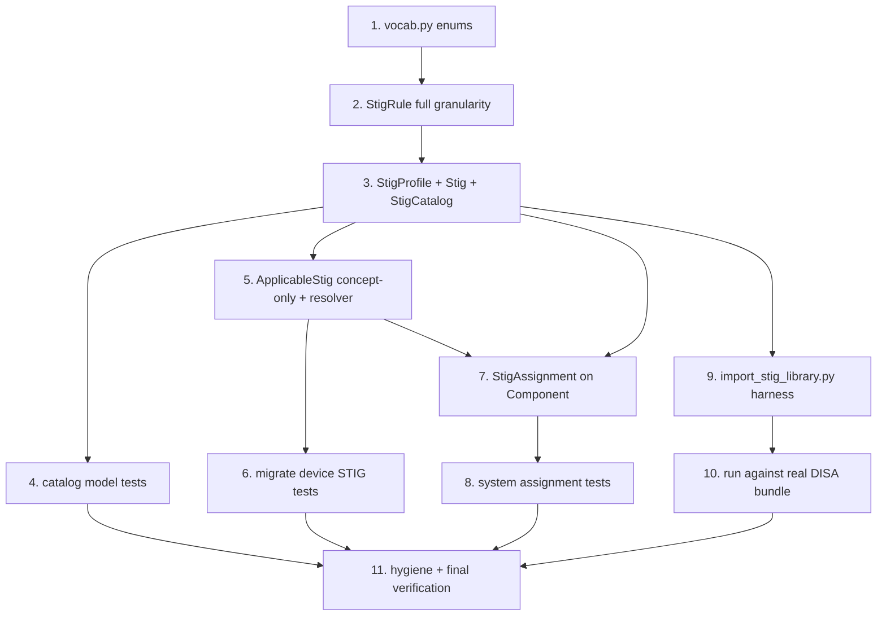

# Implementation Plan

## Overview

Incremental, test-driven build of the STIG catalog, the revised device concept
reference, the system pinned-assignment, and the stdlib-only validation harness.
Every step builds on the previous one, wires new public names into `__all__` /
top-level re-exports, and lands with tests run via `.venv/bin/python -m pytest`.

Note on the existing scaffold: `network_models/stig/{__init__,vocab,catalog}.py`
already exist but predate the finalized design. They must be **revised** to match
Part 2 of `design.md` — notably: add the `StigType` / `AssignmentStatus` /
`TargetLayer` enums; rename/replace `StigRule.check_text` → `check_content` and
add `weight`, `check_content_ref`, `check_system`, `fix_id`, `legacy_ids`;
**remove** the reserved `expected_config` field (compliance hooks are app-layer,
out of scope); add `StigProfile`; add `Stig.type` / `source_file` / `release_info`
/ `status` / `status_date` (replacing `release` / `date` / `technology` /
`source_url`); rename `StigCatalog.version` → `catalog_version`; add
`versions()` and `latest_version()`.

## Task Dependency Graph



```json
{
  "waves": [
    { "wave": 1, "tasks": ["1"] },
    { "wave": 2, "tasks": ["2"] },
    { "wave": 3, "tasks": ["3"] },
    { "wave": 4, "tasks": ["4", "5", "9"] },
    { "wave": 5, "tasks": ["6", "7", "10"] },
    { "wave": 6, "tasks": ["8"] },
    { "wave": 7, "tasks": ["11"] }
  ]
}
```

## Tasks

- [ ] 1. Revise `network_models/stig/vocab.py` with the full vocabulary set
  - Keep `RULE_SEVERITIES` (`high`/`medium`/`low`/`unknown`) and `SEVERITY_TO_CAT`.
  - Add value lists `STIG_TYPES = ["srg", "stig"]`, `ASSIGNMENT_STATUSES =
    ["not_assessed", "compliant", "open", "not_applicable", "inherited_pending"]`,
    and `TARGET_LAYERS = ["nac_config", "model"]`.
  - Build `StigType`, `AssignmentStatus`, `TargetLayer` via `_str_enum` alongside
    the existing `RuleSeverity`.
  - Update `__all__` to export the new value lists and enums; keep module docstring
    explaining verbatim-from-XCCDF intent and stdlib/pydantic-only portability.
  - _Requirements: 1.2, 1.5, 1.6, 2.1, 4.2, 10.6_ (design §2.1)

- [ ] 2. Revise `network_models/stig/catalog.py` — `StigRule` at full granularity
  - Fields per design §2.2: `group_id`, `rule_id`, `stig_id` (optional), `severity`
    (`RuleSeverity`), `weight` (optional float, `ge=0`, `allow_inf_nan=False`),
    `title`, `discussion` (optional), `check_content`, `check_content_ref`,
    `check_system`, `fix_text`, `fix_id`, `ccis: list[str]`, `legacy_ids: list[str]`.
  - **Remove** the `check_text` field (replaced by `check_content`) and **remove**
    the reserved `expected_config` field entirely (compliance hooks are app-layer).
  - Keep the derived `cat` property (`SEVERITY_TO_CAT.get(str(self.severity))`).
  - Replace `_unique_ccis` with `_unique_idents` applied to both `ccis` and
    `legacy_ids`.
  - _Requirements: 4.1, 4.2, 4.3, 4.4, 4.6, 4.7_ (design §2.2)

- [ ] 3. Add `StigProfile` and revise `Stig` / `StigCatalog`
  - Add `StigProfile` (`id`, optional `title`, `selected_rule_ids: list[str]`) with
    a `_unique_selection` field validator (no duplicate rule ids).
  - Revise `Stig` fields per design §2.2: `benchmark_id`, `title`, `version`,
    `release_info` (optional), `status` (optional), `status_date` (optional
    `date`), `type` (`StigType`, required), `source_file` (required), `profiles:
    list[StigProfile]`, `rules: list[StigRule]`. Drop the old `release`,
    `date`, `technology`, `source_url` fields.
  - Keep/adjust `severity_counts`; keep `_unique_rule_ids` (rule_id + group_id);
    add `_profiles_resolve` (every `selected_rule_ids` entry exists among rules)
    and `_unique_profile_ids`.
  - Revise `StigCatalog`: rename field `version` → `catalog_version`; keep
    `_unique_benchmark_version` and `get()` / `benchmark_ids(type=None)`; add
    `versions(benchmark_id)` and `latest_version(benchmark_id)` (rank by
    `status_date` when present, else last-seen; never parse version strings).
  - Update `__all__` to add `StigProfile`; confirm `stig/__init__.py` and
    top-level `network_models/__init__.py` re-export the new names.
  - _Requirements: 1.1, 1.6, 2.3, 2.4, 3.1, 3.2, 3.3, 3.4, 3.5, 3.6, 5.1, 5.2, 5.3, 5.4, 5.5, 5.6, 6.1, 6.2, 6.3, 12.1, 12.2, 12.3, 12.4, 12.5_ (design §2.2)

- [ ] 4. Create `tests/test_stig_catalog.py` — catalog model tests
  - A small valid `Stig`/`StigCatalog` fixture (a few rules, one profile).
  - Catalog uniqueness: duplicate `(benchmark_id, version)` raises; distinct keys
    construct (Req 3.4, 3.5).
  - `type` enum: value outside `{srg, stig}` raises; `benchmark_ids(type=...)`
    filters correctly (Req 2.1, 2.2, 2.3, 2.4).
  - Severity/CAT: `cat` == CAT I/II/III for high/medium/low, `None` for unknown;
    out-of-vocab severity raises (Req 4.3, 4.4, 4.7).
  - `severity_counts` sum equals rule count (Req 5.6).
  - Profile resolution: dangling `selected_rule_ids` raises; resolving set
    constructs; duplicate `selected_rule_ids` and duplicate profile ids raise
    (Req 5.3, 5.4, 5.5, 6.2).
  - Duplicate `rule_id` / `group_id` raise; duplicate `ccis` / `legacy_ids` raise
    (Req 4.6, 5.1, 5.2).
  - JSON round-trip: `Stig.model_validate(s.model_dump(mode="json")) == s`, order
    of rules/ccis/legacy_ids/profiles preserved (Req 7.1, 7.2).
  - `latest_version`: member of `versions()` when present, `None` when absent;
    status_date wins; last-seen fallback when no dates (Req 12.1–12.5).
  - _Requirements: 2.1, 2.2, 2.3, 2.4, 3.4, 3.5, 4.3, 4.4, 4.6, 4.7, 5.1, 5.2, 5.3, 5.4, 5.5, 5.6, 6.2, 7.1, 7.2, 12.1, 12.2, 12.3, 12.4, 12.5_

- [ ] 5. Revise `ApplicableStig` to concept-only in `network_models/device/definition.py`
  - `ApplicableStig`: keep `benchmark_id` (required) + optional `title`; **remove**
    the `version` field.
  - Change `DeviceDefinition._unique_applicable_stigs` to enforce uniqueness on
    `benchmark_id` alone (revert from the `(benchmark_id, version)` key).
  - Add opt-in method `DeviceDefinition.validate_against_catalog(catalog)` that
    raises when any `applicable_stigs.benchmark_id` is absent from
    `catalog.benchmark_ids()`; import `StigCatalog` under `TYPE_CHECKING` / lazily
    to keep import direction clean. It is NOT a `model_validator` (standalone
    definitions must still validate, incl. the gitignored `converted/` library).
  - Update device `__all__` only if a new public name is added (method needs none).
  - _Requirements: 8.1, 8.2, 8.3, 8.4, 9.1, 9.2, 9.3_ (design §2.3)

- [ ] 6. Migrate affected device STIG tests in `tests/test_models.py`
  - Drop the `version` key from `VALID["applicable_stigs"]` fixtures.
  - `test_duplicate_stig_benchmark_id_rejected`: assert duplicate `benchmark_id`
    alone is rejected (no version differentiator).
  - Remove `test_same_stig_different_versions_allowed` here (its behavior moves to
    the component layer in task 8) — or convert it to assert that a repeated
    `benchmark_id` is now rejected regardless of version.
  - Adjust the parametrized "duplicate applicable STIG" rejection case to use only
    `benchmark_id` duplication.
  - Add tests for `validate_against_catalog`: passes standalone with no catalog;
    passes when all ids resolve; raises listing unresolved ids when a catalog is
    supplied and an id is missing.
  - _Requirements: 8.3, 8.4, 9.1, 9.2, 9.3, 14.4, 14.7, 14.8_

- [ ] 7. Add `StigAssignment` and wire it into `Component` (`network_models/system/topology.py`)
  - Add `from network_models.stig.vocab import AssignmentStatus` (portable-internal).
  - Define `StigAssignment` (`benchmark_id`, `version`, `status:
    AssignmentStatus = AssignmentStatus("not_assessed")`, optional `assessed_date:
    date`, optional `notes`).
  - Add `Component.stig_assignments: list[StigAssignment]` (default empty) with a
    `_unique_stig_assignments` model validator enforcing unique
    `(benchmark_id, version)`.
  - Add opt-in `System.validate_stig_assignments(catalog)` (raises on unresolved
    `(benchmark_id, version)` via `catalog.get`) and warn-only
    `System.stig_divergences(definitions)` returning `(component_id, benchmark_id)`
    pairs a component assigns that its device definition doesn't declare (never
    raises).
  - Add `StigAssignment` to `system/topology.py` `__all__`; confirm top-level
    re-export.
  - _Requirements: 10.1, 10.2, 10.3, 10.4, 10.5, 10.6, 11.1, 11.2, 11.3, 11.4, 11.5_ (design §2.4)

- [ ] 8. Create `tests/test_system_stig.py` — component assignment tests
  - `StigAssignment` default status is `not_assessed`; status outside the closed
    set raises (Req 10.2, 10.6).
  - Duplicate `(benchmark_id, version)` on one component raises (Req 10.4).
  - Same `benchmark_id` at two different versions on one component is accepted —
    this is the relocated `test_same_stig_different_versions_allowed` (Req 10.5, 14.6, 14.8).
  - `System.validate_stig_assignments`: validates standalone without a catalog;
    passes when all pins resolve; raises identifying the unresolved pin (Req 11.1, 11.2, 11.3).
  - `System.stig_divergences`: returns exactly the undeclared `(component_id,
    benchmark_id)` pairs; empty when all backed by the definition; never raises
    (Req 11.4, 11.5).
  - _Requirements: 10.2, 10.4, 10.5, 10.6, 11.1, 11.2, 11.3, 11.4, 11.5, 14.5, 14.6, 14.8_

- [ ] 9. Implement `scripts/import_stig_library.py` validation harness
  - Mirror `scripts/import_devicetype_library.py` structure (argparse, `sys.path`
    insert, `--out` with a default gitignored dir, grouped failure summary, manifest).
  - `COLLECT_XCCDF(path)`: accept a directory of ZIPs, a single `*.zip`, a loose
    `*-xccdf.xml`, or a directory of loose XML; read inner `*-xccdf.xml` members via
    stdlib `zipfile`; use the outer zip (or file) name as `source_file`.
  - `PARSE_BENCHMARK(xml_bytes, source_file)` via stdlib `xml.etree.ElementTree`
    (namespace `http://checklists.nist.gov/xccdf/1.1`): verbatim `benchmark_id`
    (`Benchmark/@id`) and `version` (`<version>`); `release_info` from the
    `release-info` plain-text; `status` + `status_date`; per-Group/Rule fields
    (severity, weight, stig_id from `<version>`, title, ccis/legacy_ids by `ident
    @system` suffix, check_content/ref/system, fix_text/fix_id); `discussion` via
    `EXTRACT_VULN_DISCUSSION` (`html.unescape` then slice `<VulnDiscussion>`, raw
    fallback); `type` via `CLASSIFY_TYPE` (srg vs stig from id/title/filename);
    profiles remapped from Group V-ids to Rule ids.
  - Validate each parsed benchmark into `Stig`; group failures by first-error cause;
    non-zero exit if any file fails to parse or validate.
  - `--out`: write `<benchmark_id>_<version>.json` per benchmark plus
    `catalog_manifest.json` (benchmark_id, version, type, title, rule_count,
    source_file) into `stig_catalog/`.
  - _Requirements: 13.1, 13.2, 13.3, 13.4, 13.5, 13.6, 13.7, 13.8, 13.9_ (design §2.5)

- [ ] 10. Run the harness against the real DISA bundle and reconcile
  - Run `.venv/bin/python scripts/import_stig_library.py U_SRG-STIG_Library_April_2026`
    (also test the loose `U_AAA_Services_SRG_V2R2_Manual-xccdf.xml` and `--out`).
  - Iterate on the parser/model until the 188-entry bundle validates 100% or every
    failure is understood and grouped by cause (mirroring the devicetype-library
    exercise). Fix genuine model/parse gaps; document any benchmarks that are
    legitimately malformed upstream.
  - _Requirements: 13.5, 13.6, 13.7, 13.9_

- [ ] 11. Repository hygiene and final verification
  - Add `stig_catalog/` to `.gitignore` (Req 15.1).
  - Confirm `network_models/stig` is reflected in steering `structure.md` (note the
    app-layer boundary for ComplianceCheck / suggestion mapping / upload importer /
    who-must-update query is already documented; update only if the realized layout
    differs).
  - Run the full suite: `.venv/bin/python -m pytest -q` — all pass, integration
    tests skipped without their env; re-run the devicetype-library integration test
    to confirm the `ApplicableStig` change didn't regress the converted library.
  - _Requirements: 14.1, 14.2, 14.3, 15.1_

## Notes

- **Scope boundary:** No tasks implement the app-layer pieces — the
  `ComplianceCheck` model + evaluator, the picker suggestion mapping, the
  production upload importer, or the "which devices must update" query. Those are
  documented as non-goals in `requirements.md` and boundaries in `design.md`. The
  `TargetLayer` enum (task 1) is the only shared vocabulary carried here for the
  future compliance layer.
- **Portability:** `network_models/` stays pydantic + stdlib only. The harness
  (`scripts/`) may use stdlib `zipfile`, `xml.etree.ElementTree`, `html`, `json`,
  `argparse`, `pathlib` — no third-party XML libraries.
- **Python floor 3.10:** no `enum.StrEnum`; all enums use the `_str_enum` helper.
  All modules start with `from __future__ import annotations`.
- **Testing baseline:** standard `pytest` (the only test extra). Correctness
  properties from design Part 2 are covered as example-based tests; `hypothesis`
  property-based tests are optional and only if the `test` extra adopts it.
- **Run commands:** `.venv/bin/python -m pytest -q` for the suite;
  `.venv/bin/python scripts/import_stig_library.py U_SRG-STIG_Library_April_2026`
  for the integration harness.
