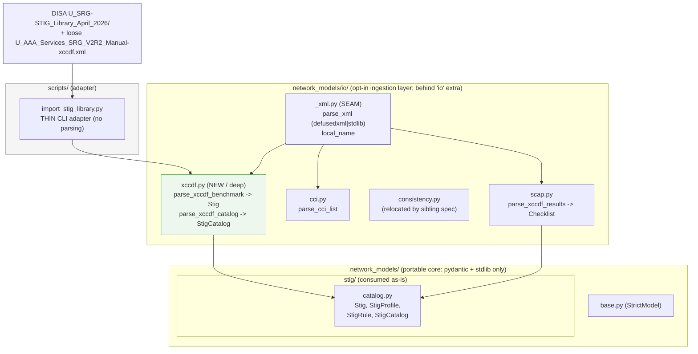
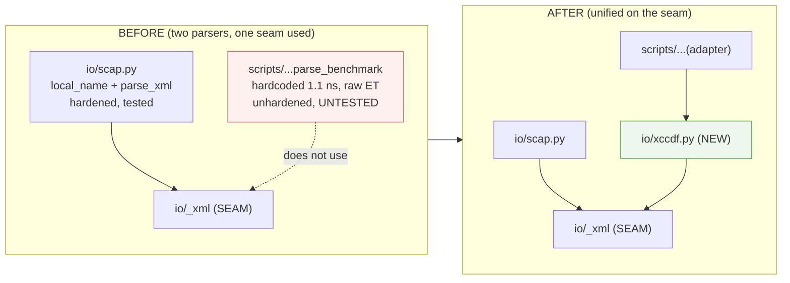
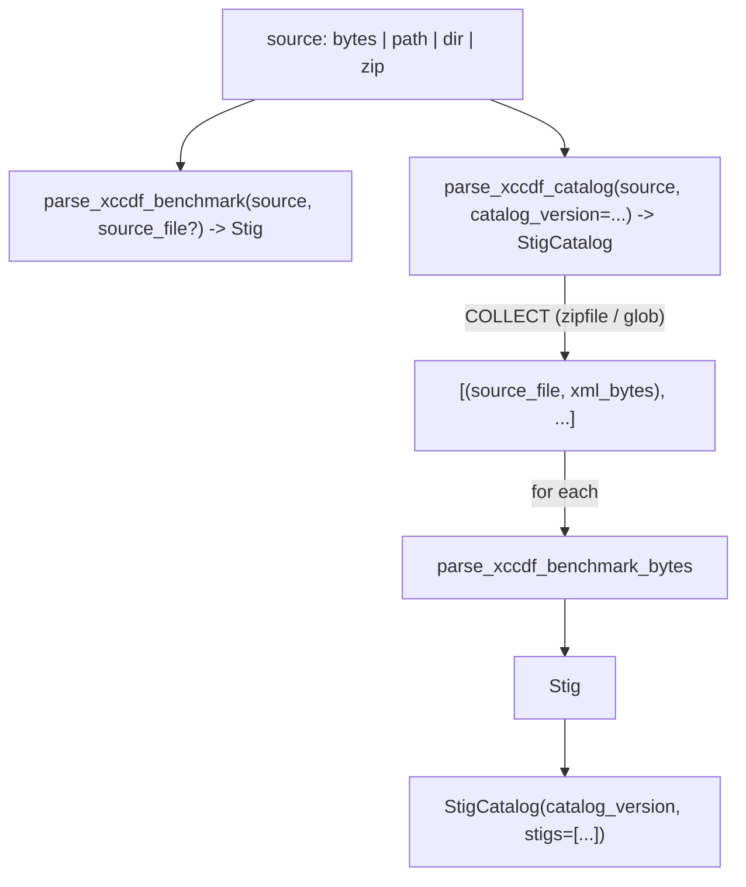

# Design Document: xccdf-parser-unify

## Overview

The repository ships **two XCCDF parsers** that share a subject and a hardened,
version-tolerant XML **seam** — yet only one leverages it. This feature deepens the
opt-in ingestion layer by promoting the second parser into that layer so both are
built on the same seam, then reducing the harness script to a thin **adapter**.

- **Results parser** (`network_models/io/scap.py::parse_xccdf_results`): XCCDF
  `TestResult` → `Checklist`. **Deep and correct** — it matches elements by
  `io/_xml.local_name` (version-tolerant across XCCDF 1.1/1.2) and parses through
  `io/_xml.parse_xml` (hardened: `defusedxml` when the `io` extra is installed,
  XXE-safe stdlib fallback otherwise). It lives in the portable package's opt-in
  `io/` layer.
- **Benchmark parser** (`scripts/import_stig_library.py::parse_benchmark`): XCCDF
  `Benchmark` → `Stig`. **Shallow and stranded** — ~165 LOC of parsing that lives
  *outside* the portable package, hardcodes the `{http://checklists.nist.gov/xccdf/1.1}`
  namespace over raw `ET.fromstring`, has no hardening, and has zero unit tests.
  Meanwhile `network_models/stig/*.py` docstrings advertise a "byte-for-byte
  importer" the package does not actually ship.

The two are the **same idea implemented twice** at different depths, on opposite
sides of the portability boundary. This design **unifies** them: a new deep module
`network_models/io/xccdf.py` becomes the single home for benchmark parsing, sitting
beside `scap.py`, sharing the `io/_xml` seam, mirroring `scap.py`'s interface
shape. The script becomes an **adapter** — CLI orchestration only, no parsing.

The gain is **locality of behavior** (all XCCDF parsing in one layer, on one seam),
a **deeper interface** (`parse_xccdf_benchmark` / `parse_xccdf_catalog` hide the
ZIP-collection and namespace-tolerance machinery behind a two-call surface), and
the retirement of a shallow, untested, unhardened duplicate.

---

## Scope Boundary (read this first)

| Concern | In scope (this feature) | Out of scope | Rationale |
|---|---|---|---|
| Benchmark parser `io/xccdf.py` (`parse_xccdf_benchmark`) | ✅ new deep module in `io/` | — | Portable, hardened, tested peer of `scap.py` |
| Collection fold (`parse_xccdf_catalog`) | ✅ ZIP/loose-XML → `StigCatalog` | — | Moves script's `collect_xccdf` into `io/` |
| Harness `scripts/import_stig_library.py` | ✅ reduced to thin CLI adapter | — | Single source of truth for parsing |
| Ingestion tests (`test_io_xccdf.py` + backfill) | ✅ new + `parse_xccdf_results`/`parse_cci_list` | — | Verify the layer as a whole |
| Catalog model shape (`Stig`, `StigRule`, ...) | ❌ consumed as-is | ✅ owned by `stig-catalog` | No field churn |
| Results parser internals (`scap.py`) | ❌ unchanged | ✅ | Add a sibling, don't restructure |
| App-layer compliance evaluator | ❌ | ✅ knows NaC schema, JMESPath | Portability boundary |
| Relocating `io/consistency.py` | ❌ | ✅ owned by `concentrate-shared-rules` | Independent sibling spec |

**Portability boundary (hard rule):** `network_models/` (the core) imports only
`pydantic` and the standard library. The `io/` subpackage is the **opt-in
ingestion layer** — not imported by the core — and *may* use stdlib `zipfile`,
`xml.etree.ElementTree`, `html`, and (behind the `io` extra) `defusedxml`. The new
`io/xccdf.py` lives entirely within that layer; the core never imports it.

---

# Part 1 — High-Level Design

## Architecture



## Before / after: collapsing the duplicate



## The two-call ingestion interface



## Modules and Interfaces

### `network_models/io/xccdf.py` (NEW — deep module)

- **Purpose:** the single canonical XCCDF **benchmark** parser; the deepening
  target of this feature. It hides namespace-tolerance, HTML-unescaping,
  Group→Rule remapping, and ZIP collection behind a small interface.
- **Interface (mirrors `scap.py`):**
  - `parse_xccdf_benchmark(source, *, source_file=None) -> Stig`
  - `parse_xccdf_benchmark_bytes(data, *, source_file) -> Stig`
  - `parse_xccdf_benchmark_file(path, *, source_file=None) -> Stig`
  - `parse_xccdf_catalog(source, *, catalog_version) -> StigCatalog`
- **Leverages:** `io/_xml.parse_xml` (hardening) and `io/_xml.local_name`
  (version-tolerance) — the same seam `scap.py` uses. Standard-library `zipfile`,
  `html`, `pathlib`, `datetime` for collection and field mapping.
- **Responsibilities:** faithful, byte-for-byte field mapping (Requirement 4);
  hardened, version-tolerant parsing; collection of ZIP/loose sources into a
  validated `StigCatalog`. No CLI, no printing, no `sys.exit`.

### `network_models/io/_xml.py` (SEAM — extended)

- **Purpose:** shared hardened-XML helper. Already exposes `parse_xml` and
  `local_name`. This feature adds child-scoped local-name lookup helpers so the
  benchmark parser can resolve elements by parent scope (Requirement 3.4) without
  re-deriving them per module.
- **Interface (added):** `first_child(elem, name)`, `find_children(elem, name)` —
  first / all *direct children* whose `local_name` matches. (Contrast with
  `scap.py`'s descendant-scoped `_iter_local`, which is correct for results but
  would let a rule-level `<version>` masquerade as the benchmark `<version>`.)
- **Rationale for the seam:** benchmark parsing needs *scoped* matches
  (`Benchmark/version` vs `Rule/version`); results parsing needs *descendant*
  matches. Both are "match by local name" — putting the child-scoped variant in
  `_xml` keeps the single matching concept in one place and leverages it twice.

### `scripts/import_stig_library.py` (ADAPTER)

- **Purpose:** CLI orchestration only. Collects results, groups failures, writes
  JSON, sets the exit code. Contains no XCCDF or ZIP parsing.
- **Interface:** unchanged CLI — positional library path, `--max-examples`,
  `--out` (const-default `stig_catalog/`).
- **Leverages:** `parse_xccdf_catalog` / `parse_xccdf_benchmark_bytes` from
  `io/xccdf.py`; catches the parser's errors to build the grouped summary.

## Error Handling

| Scenario | Condition | Response | Recovery |
|---|---|---|---|
| Malformed XML | `parse_xml` raises `ParseError` | propagate from `parse_xccdf_benchmark_bytes` | adapter records file, continues |
| Missing `<Benchmark>` root | no benchmark element | `ValueError("no XCCDF <Benchmark> ...")` (mirrors scap's `TestResult` guard) | fix/skip file |
| Model rejects fields | parsed kwargs violate `Stig` invariants | `ValidationError` from `Stig(**kwargs)` | adapter groups by first-error cause |
| Duplicate catalog key | two docs share `(benchmark_id, version)` | `ValidationError` at `StigCatalog` | dedupe input / use per-file parse |
| Bad ZIP | `zipfile.BadZipFile` / `OSError` | skipped during collection (as today) | reported by adapter as load error |
| Invalid `status @date` | non-ISO date string | `status_date` left `None` (best-effort) | none needed |

## Testing Strategy

- **Unit (pytest, following `tests/test_io_scap.py`):** `test_io_xccdf.py` — parse
  the loose repo fixture (bytes + file); version-tolerance (same synthetic doc in
  1.1 and 1.2 namespaces → equal fields); catalog fold over a synthetic ZIP and
  loose XML; malformed-XML error path; `source_file` propagation.
- **Backfill (`test_io_ingestion.py`):** direct coverage for `parse_xccdf_results`
  and `parse_cci_list` as first-class siblings (the existing `test_io_scap.py`
  already exercises them lightly; the backfill makes the coverage explicit and
  co-located with the new peer).
- **Parity check:** assert `parse_xccdf_benchmark_bytes(x, source_file=s)` equals
  the pre-refactor `scripts.import_stig_library.parse_benchmark` output (captured
  before the script is gutted) on the loose fixture — enforces Requirement 4.8.
- **Integration:** `scripts/import_stig_library.py` run against the real
  `U_SRG-STIG_Library_April_2026/` bundle must reproduce the pre-refactor
  pass/fail outcome.

## Security / Performance Considerations

- **Untrusted content is now hardened.** Moving benchmark parsing onto
  `io/_xml.parse_xml` means DISA content is parsed with `defusedxml` (XXE +
  entity-expansion + quadratic-blowup protection) when the `io` extra is installed,
  and the XXE-safe stdlib fallback otherwise — closing the gap where the script
  used raw `ET.fromstring`.
- **Content stays opaque text.** Discussion/check/fix bodies are stored as strings;
  no HTML is rendered or executed by the parser (it only `html.unescape`s to slice
  `<VulnDiscussion>`).
- **Streaming collection.** `parse_xccdf_catalog` reads one archive/member at a
  time; memory is one document at a time. Complexity is O(total XML size).

## Dependencies

- `network_models.io.xccdf`: stdlib `zipfile`, `html`, `pathlib`, `datetime`,
  `os`, `typing`; internal `io/_xml`; `network_models.stig.catalog`.
- Hardening: optional `defusedxml` via the existing `io` extra — **no new
  third-party dependency** (`pyproject.toml` unchanged except, if desired, a
  docstring note).
- The portable core imports none of the above.

---

# Part 2 — Low-Level Design

Notation: Python matching the repo. All ingestion modules use
`from __future__ import annotations`. The benchmark parser mirrors `scap.py`'s
dispatch trio (`*_bytes` / `*_file` / dispatch) and its module-doc style. Support
floor is Python 3.10.

## 2.1 `network_models/io/_xml.py` — child-scoped local-name helpers (added)

The existing seam is unchanged except for two additions. `parse_xml` and
`local_name` stay exactly as today (hardened backend selection, `{ns}` stripping).

```python
def first_child(elem, name: str):
    """First *direct child* of ``elem`` whose local tag name is ``name`` (or None)."""
    for child in elem:
        if local_name(child.tag) == name:
            return child
    return None


def find_children(elem, name: str):
    """All *direct children* of ``elem`` whose local tag name is ``name``."""
    return [child for child in elem if local_name(child.tag) == name]
```

> Child-scoped (not descendant-scoped) on purpose: the benchmark parser must not
> confuse a rule-level `<version>` (STIG-ID) with the benchmark-level `<version>`.
> `scap.py`'s descendant `_iter_local` is correct for its results shape and is left
> untouched. Both variants express one concept — "match by local name" — kept in
> the one seam module (`_xml`) so it is leveraged, not re-implemented.

## 2.2 `network_models/io/xccdf.py` — module shape (mirrors `scap.py`)

```python
"""Parse XCCDF *benchmark* documents into :class:`Stig`s (and collections into
:class:`StigCatalog`).

This is the reference-library ingestion side, the peer of :mod:`scap` (which
parses XCCDF *results*). It replaces the parsing that previously lived inside
``scripts/import_stig_library.py``: the logic now sits in the portable package's
opt-in ``io`` layer, shares the hardened, version-tolerant :mod:`io._xml` seam,
and mirrors :func:`scap.parse_xccdf_results`'s dispatch shape.

Version-tolerant: elements are matched by *local* tag name, so XCCDF 1.1 and 1.2
benchmarks both parse (parity with :mod:`scap`). Hardened: bytes go through
:func:`io._xml.parse_xml` (``defusedxml`` when the ``io`` extra is installed;
XXE-safe stdlib fallback otherwise).
"""

from __future__ import annotations

import html
import os
import zipfile
from datetime import date
from pathlib import Path
from typing import Any, Optional, Union

from network_models.io._xml import find_children, first_child, local_name, parse_xml
from network_models.stig.catalog import Stig, StigCatalog

# NOTE: no module-level namespace constant. The hardcoded
# "{http://checklists.nist.gov/xccdf/1.1}" of the old script is deliberately gone.
```

## 2.3 Field-mapping helpers (ported verbatim from the script)

These are lifted unchanged from `scripts/import_stig_library.py` — the mapping is
byte-for-byte identical (Requirement 4); only the element-lookup calls change from
`ET.find(f"{ns}tag")` to the local-name helpers.

```python
def _text(el) -> Optional[str]:
    """Element text or None if absent/empty (verbatim, no strip — matches script)."""
    if el is None:
        return None
    return el.text if el.text else None


def _extract_vuln_discussion(raw_description: Optional[str]) -> Optional[str]:
    """html.unescape then slice <VulnDiscussion>...; raw unescaped fallback."""
    if not raw_description:
        return None
    unescaped = html.unescape(raw_description)
    start_tag, end_tag = "<VulnDiscussion>", "</VulnDiscussion>"
    start = unescaped.find(start_tag)
    if start != -1:
        end = unescaped.find(end_tag, start)
        if end != -1:
            return unescaped[start + len(start_tag):end].strip() or None
    return unescaped.strip() or None


def _classify_type(benchmark_id: str, title: str, source_file: str) -> str:
    """'srg' if 'srg'/'security requirements guide' in id+title+filename, else 'stig'."""
    hay = f"{benchmark_id} {title} {source_file}".lower()
    if "srg" in hay or "security requirements guide" in hay:
        return "srg"
    return "stig"
```

## 2.4 Benchmark parse core — pseudocode

Structurally identical to the current `parse_benchmark`, with two substitutions:
(a) namespaced `find`/`findall` become `first_child` / `find_children`
local-name lookups; (b) `ET.fromstring` becomes `parse_xml`.

```pascal
ALGORITHM PARSE_XCCDF_BENCHMARK_BYTES(data, source_file)
INPUT:  raw XCCDF benchmark bytes (1.1 or 1.2), source_file name
OUTPUT: a validated Stig
PRECONDITION:  root local_name == "Benchmark"
POSTCONDITION: returned Stig has unique rule_ids; profiles resolve
BEGIN
    root <- parse_xml(data)                       // hardened backend
    IF local_name(root.tag) != "Benchmark" THEN
        RAISE ValueError("no XCCDF <Benchmark> element found in document")

    benchmark_id <- root.get("id") or ""                       // VERBATIM
    title        <- _text(first_child(root, "title")) or benchmark_id
    version      <- _text(first_child(root, "version")) or "0" // benchmark scope

    status_el    <- first_child(root, "status")
    status       <- _text(status_el)
    status_date  <- ISO_DATE_OR_NONE(status_el?.get("date"))

    release_info <- text of the first_child(root,"plain-text") whose @id=="release-info"
    type         <- _classify_type(benchmark_id, title, source_file)   // srg|stig

    rules <- empty list ; group_to_rule <- empty map
    FOR each G IN find_children(root, "Group") DO
        group_id <- G.get("id") or ""
        R <- first_child(G, "Rule")
        IF R is None THEN CONTINUE
        rule_id  <- R.get("id") or ""
        group_to_rule[group_id] <- rule_id

        check_el <- first_child(R, "check")
        rules.add({
            group_id, rule_id,
            stig_id           = _text(first_child(R, "version")),        // rule scope
            severity          = R.get("severity") or "unknown",          // verbatim
            weight            = FLOAT_OR_NONE(R.get("weight")),
            title             = _text(first_child(R, "title")) or "",
            discussion        = _extract_vuln_discussion(_text(first_child(R,"description"))),
            check_content     = _text(first_child(check_el, "check-content")) if check_el,
            check_content_ref = (ccr.get("name") or ccr.get("href"))       // ccr under check
                                  where ccr = first_child(check_el, "check-content-ref"),
            check_system      = check_el.get("system") if check_el,
            fix_text          = _text(first_child(R, "fixtext")),
            fix_id            = first_child(R,"fix")?.get("id")
                                  or first_child(R,"fixtext")?.get("fixref"),
            ccis       = DEDUP([ i.text for i in find_children(R,"ident")
                                  if (i.get("system") or "").endswith("/cci") and i.text ]),
            legacy_ids = DEDUP([ i.text for i in find_children(R,"ident")
                                  if (i.get("system") or "").endswith("/legacy") and i.text ]),
        })
    END FOR

    profiles <- empty list
    FOR each P IN find_children(root, "Profile") DO
        selected_group_ids <- [ sel.get("idref") FOR sel IN find_children(P,"select")
                                  WHERE sel.get("selected") == "true" AND sel.get("idref") ]
        selected_rule_ids  <- DEDUP([ group_to_rule.get(gid, gid)
                                        FOR gid IN selected_group_ids ])   // V-id -> rule id
        profiles.add({ id = P.get("id") or "",
                       title = _text(first_child(P,"title")),
                       selected_rule_ids })
    END FOR

    RETURN Stig(benchmark_id=benchmark_id, title=title, version=version,
                release_info=release_info, status=status, status_date=status_date,
                type=type, source_file=source_file, profiles=profiles, rules=rules)
END
```

`_build_stig_kwargs` may be factored out (returning the dict) so both
`parse_xccdf_benchmark_bytes` and the parity test can reuse it; the public
functions wrap it in `Stig(**kwargs)`.

## 2.5 Dispatch + file entry points (mirror `scap.py`)

```python
def parse_xccdf_benchmark_bytes(data: bytes, *, source_file: str) -> Stig:
    return Stig(**_build_stig_kwargs(bytes(data), source_file))


def parse_xccdf_benchmark_file(
    path: Union[str, os.PathLike], *, source_file: Optional[str] = None
) -> Stig:
    p = Path(path)
    with open(p, "rb") as fh:
        return parse_xccdf_benchmark_bytes(fh.read(), source_file=source_file or p.name)


def parse_xccdf_benchmark(
    source: Union[str, bytes, os.PathLike], *, source_file: Optional[str] = None
) -> Stig:
    """Parse an XCCDF benchmark from raw ``bytes`` or a file path.

    ``bytes`` are the raw document (``source_file`` defaults to ``"<bytes>"`` when
    omitted); ``str`` / ``PathLike`` are read from disk (``source_file`` defaults
    to the base name). Mirrors :func:`scap.parse_xccdf_results`.
    """
    if isinstance(source, (bytes, bytearray)):
        return parse_xccdf_benchmark_bytes(bytes(source), source_file=source_file or "<bytes>")
    return parse_xccdf_benchmark_file(source, source_file=source_file)
```

## 2.6 Collection fold — pseudocode (moved out of the script)

`collect_xccdf` and `_read_xccdf_from_zip` move here verbatim (private helpers),
then `parse_xccdf_catalog` folds them into a `StigCatalog`.

```pascal
ALGORITHM COLLECT_XCCDF(path)  // returns [(source_file, xml_bytes), ...]
BEGIN
    IF path.is_file() THEN
        IF suffix == ".zip"           THEN RETURN READ_ZIP(path)
        IF name endswith "-xccdf.xml" THEN RETURN [(path.name, read_bytes(path))]
        RETURN READ_ZIP(path)                      // try as zip anyway (as today)
    IF path.is_dir() THEN
        docs <- []
        FOR each zp IN sorted(glob(path, "*.zip"))        DO docs += READ_ZIP(zp)
        FOR each xml IN sorted(glob(path, "*-xccdf.xml")) DO docs += [(xml.name, read_bytes(xml))]
        RETURN docs
    RETURN []
END

ALGORITHM READ_ZIP(zip_path)   // _read_xccdf_from_zip: source_file = OUTER zip name
BEGIN
    TRY WITH zipfile.ZipFile(zip_path) AS zf:
        RETURN [ (zip_path.name, zf.read(m)) FOR m IN zf.namelist()
                   WHERE m endswith "-xccdf.xml" ]
    CATCH (BadZipFile, OSError): RETURN []          // caller reports as load error
END

ALGORITHM PARSE_XCCDF_CATALOG(source, catalog_version)
BEGIN
    docs  <- COLLECT_XCCDF(Path(source))
    stigs <- [ parse_xccdf_benchmark_bytes(xml, source_file=src)
                 FOR (src, xml) IN docs ]           // raises on first bad doc
    RETURN StigCatalog(catalog_version=catalog_version, stigs=stigs)
END
```

> **Design note — fold vs. per-file tolerance.** `parse_xccdf_catalog` is
> strict: any malformed document or duplicate `(benchmark_id, version)` raises, so
> callers wanting a clean `StigCatalog` fail fast. The harness (§2.8) does **not**
> use the fold — it iterates `collect_xccdf` + `parse_xccdf_benchmark_bytes`
> per file so it can catch, group, and continue past individual failures (the DISA
> bundle contains a known duplicate `(Network_Device_Management_SRG, 5)` across two
> ZIPs). Both entry points are offered; the strict fold is the library convenience,
> the per-file loop is the resilient harness path.

## 2.7 Public surface / `__all__` / re-exports

```python
# io/xccdf.py
__all__ = [
    "parse_xccdf_benchmark",
    "parse_xccdf_benchmark_bytes",
    "parse_xccdf_benchmark_file",
    "parse_xccdf_catalog",
]
```

`io/__init__.py` gains the star-import + `__all__` splice, mirroring the existing
`scap` / `cci` / `consistency` wiring:

```python
from network_models.io.xccdf import *          # noqa: F401,F403
from network_models.io.xccdf import __all__ as _xccdf_all
# ...
__all__ = list(_scap_all) + list(_cci_all) + list(_consistency_all) + list(_xccdf_all)
```

> The portable core (`network_models/__init__.py`) does **not** re-export `io`;
> ingestion stays opt-in (`from network_models.io import parse_xccdf_benchmark`).
> `_xml.py`'s `__all__` gains `first_child`, `find_children`.

## 2.8 `scripts/import_stig_library.py` — reduced to an adapter

Everything from `_NS` through `parse_benchmark`, `_extract_vuln_discussion`,
`_classify_type`, `_text`, `collect_xccdf`, and `_read_xccdf_from_zip` is
**deleted** from the script and imported from `io/xccdf.py`. What remains is CLI
orchestration only.

```python
from network_models.io.xccdf import (
    collect_xccdf,               # or a public re-export of it
    parse_xccdf_benchmark_bytes,
)
from network_models.stig.catalog import Stig
from network_models.io._xml import parse_xml  # for ParseError typing, if needed

def main() -> int:
    args = _parse_args()                       # positional path, --max-examples, --out
    docs = collect_xccdf(args.library)         # from io.xccdf
    ...
    for source_file, xml_bytes in docs:
        try:
            stig = parse_xccdf_benchmark_bytes(xml_bytes, source_file=source_file)
        except ParseError as e:
            load_errors.append((source_file, f"XML parse error: {e}")); continue
        except ValidationError as exc:
            failures.setdefault(_first_error_key(exc), []).append(...); continue
        ok += 1
        if out_dir: _write_json(stig, out_dir); manifest.append(_manifest_row(stig))
    _print_summary(...)                        # unchanged output shape
    return 0 if not (failed or load_errors) else 1
```

The grouping (`_first_error_key`), summary printing, `--out` JSON writing, and
manifest layout are unchanged. The adapter keeps only `argparse`, `json`, `sys`,
`pathlib` imports — no `xml`, no `zipfile`, no `html` (those now live in `io`).
`collect_xccdf` is exposed from `io/xccdf.py` (public or via re-export) so the
adapter can iterate for the catch-and-continue behavior of Requirement 6.6.

## 2.9 Behavioral parity checklist

| Field / behavior | Old (`scripts.parse_benchmark`) | New (`io.xccdf`) | Same? |
|---|---|---|---|
| `benchmark_id`, `version` | `root.get("id")`, `root.find(ns+"version")` | `root.get`, `first_child(root,"version")` | ✅ |
| namespace | hardcoded `{...1.1}` | local_name (1.1 **and** 1.2) | superset |
| XML backend | `ET.fromstring` (unhardened) | `parse_xml` (defusedxml/stdlib) | hardened |
| `discussion` | `html.unescape` + `<VulnDiscussion>` slice | identical helper | ✅ |
| `ccis` / `legacy_ids` | `@system` endswith `/cci` `/legacy`, dedup | identical | ✅ |
| profile remap | Group `@id` → child Rule `@id`, dedup | identical | ✅ |
| `type` | `_classify_type(id,title,file)` | identical helper | ✅ |
| `source_file` | outer zip / loose file name | identical (via COLLECT) | ✅ |
| malformed XML | `ET.ParseError` caught in `main` | `ParseError` caught in adapter | ✅ |

## 2.10 Correctness properties

Stated as universally-quantified invariants; each a candidate test.

### Property 1: Benchmark round-trip through the new parser
∀ well-formed benchmark bytes `b` with `source_file s`:
`parse_xccdf_benchmark_bytes(b, source_file=s)` returns a `Stig` whose
`source_file == s` and whose `benchmark_id`/`version` equal the document's verbatim
`Benchmark/@id` and benchmark-level `<version>`.

### Property 2: Parity with the retired parser
∀ benchmark bytes `b`: `parse_xccdf_benchmark_bytes(b, source_file=s)` equals the
pre-refactor `scripts.import_stig_library.parse_benchmark(b, s)` result (captured
before deletion), field-for-field.

### Property 3: Namespace tolerance
∀ benchmark `b` and its namespace-swapped twin `b'` (1.1 ↔ 1.2, identical local
structure): `parse_xccdf_benchmark_bytes(b, ...) == parse_xccdf_benchmark_bytes(b', ...)`.

### Property 4: Scope correctness
∀ benchmark with both a benchmark-level and rule-level `<version>`: the `Stig.version`
comes from the benchmark scope and each `StigRule.stig_id` from its rule scope
(they are never conflated).

### Property 5: Catalog fold soundness
∀ collection whose documents parse and whose `(benchmark_id, version)` keys are
distinct: `parse_xccdf_catalog(src, catalog_version=v)` returns a validated
`StigCatalog` with `catalog_version == v` and one `Stig` per document.

### Property 6: Hardened + XXE-safe
∀ benchmark bytes: parsing routes through `io/_xml.parse_xml`; with the `io` extra
installed the backend is `defusedxml` (`_xml.HARDENED is True`), and external
entities are never expanded regardless of backend.

### Property 7: Malformed input is catchable
∀ non-XML / truncated bytes: `parse_xccdf_benchmark_bytes` raises a `ParseError`
the harness can catch to record and continue.

## 2.11 Test plan (`tests/test_io_xccdf.py`, `tests/test_io_ingestion.py`)

- `test_io_xccdf.py`
  - parse the loose fixture `U_AAA_Services_SRG_V2R2_Manual-xccdf.xml` from bytes
    and via the file entry point; assert `type == "srg"`, non-empty `rules`,
    `source_file` set (Req 7.2, 1.4, 1.6).
  - a small synthetic benchmark served in 1.1 and 1.2 namespaces → equal `Stig`
    (Req 3, Property 3).
  - scope test: benchmark `<version>` vs rule `<version>`/`stig_id` (Property 4).
  - `parse_xccdf_catalog` over an in-memory ZIP (built with `zipfile`) plus a loose
    XML path → validated `StigCatalog` (Req 2, Property 5).
  - malformed bytes → `ParseError` (Req 5.4, Property 7).
  - parity: compare against a captured `parse_benchmark` baseline on the fixture
    (Req 4.8, Property 2).
- `test_io_ingestion.py`
  - `parse_xccdf_results`: status mapping, `group_id` resolution from an embedded
    benchmark, CCI extraction, `end-time` parsing, missing-`TestResult` `ValueError`.
  - `parse_cci_list`: `cci_item` → 800-53 control extraction, 800-53 preference over
    unlabelled references, control-id normalization (`AC-2 (1)` → `AC-2(1)`).

## 2.12 Steering note

Update `.kiro/steering/structure.md` to list `io/xccdf.py` beside `scap.py`,
`cci.py`, and `consistency.py` in the `io/` layer description (benchmark → `Stig`
ingestion), reinforcing that all XCCDF parsing now lives on the `io/_xml` seam.
</content>
