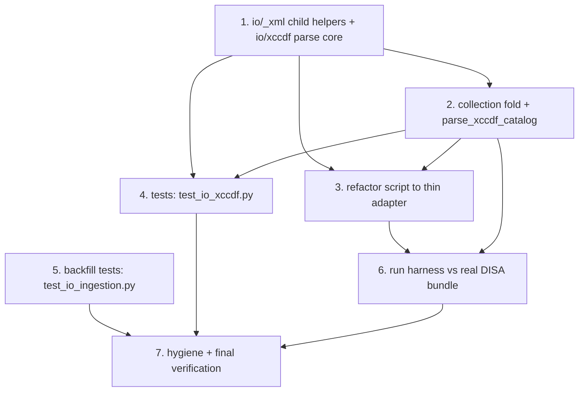

# Implementation Plan

## Overview

Incremental, test-driven unification of the two XCCDF parsers. The benchmark
parser is promoted out of `scripts/import_stig_library.py` into a new deep module
`network_models/io/xccdf.py` that shares the hardened, version-tolerant `io/_xml`
seam and mirrors `scap.py`'s interface shape; the script is then reduced to a thin
CLI adapter. Every step re-reads the current code (the modules move under active
sibling specs), wires new public names into `__all__` / `io` re-exports, and lands
with tests run via `.venv/bin/python -m pytest -q`.

Note on the current state: `scripts/import_stig_library.py` already contains a
complete, working `parse_benchmark` / `collect_xccdf` / `_read_xccdf_from_zip`
implementation (validated 100% against the DISA bundle). This plan **moves** that
logic into `io/xccdf.py` on the `io/_xml` seam — the field mapping is preserved
byte-for-byte (design §2.9), so capture a parity baseline from `parse_benchmark`
before deleting it.

## Task Dependency Graph



```json
{
  "waves": [
    { "wave": 1, "tasks": ["1"] },
    { "wave": 2, "tasks": ["2", "5"] },
    { "wave": 3, "tasks": ["3", "4"] },
    { "wave": 4, "tasks": ["6"] },
    { "wave": 5, "tasks": ["7"] }
  ]
}
```

## Tasks

- [ ] 1. Create `network_models/io/xccdf.py` parse core on the `io/_xml` seam
  - Re-read `network_models/io/scap.py`, `network_models/io/_xml.py`, and
    `scripts/import_stig_library.py::parse_benchmark` before writing.
  - Add child-scoped local-name helpers `first_child(elem, name)` and
    `find_children(elem, name)` to `network_models/io/_xml.py`; add them to that
    module's `__all__` (design §2.1). Leave `parse_xml` / `local_name` untouched.
  - Create `io/xccdf.py` with `from __future__ import annotations`, the module
    docstring (peer-of-`scap` framing, no hardcoded namespace), and imports of
    `parse_xml` / `local_name` / `first_child` / `find_children` from `io/_xml`
    and `Stig` / `StigCatalog` from `network_models.stig.catalog`.
  - Port the field-mapping helpers verbatim: `_text`, `_extract_vuln_discussion`,
    `_classify_type` (design §2.3). Implement `_build_stig_kwargs(data, source_file)`
    parsing via `parse_xml` and resolving every element by local name (design §2.4),
    correctly scoping benchmark `<version>` vs rule `<version>`/`stig_id`.
  - Implement `parse_xccdf_benchmark_bytes`, `parse_xccdf_benchmark_file`, and the
    `parse_xccdf_benchmark` dispatch, mirroring `scap.py`'s trio (design §2.5).
  - Raise a `ValueError` when the root is not a `<Benchmark>` (mirrors scap's
    `TestResult` guard); let `parse_xml` raise `ParseError` on malformed input.
  - _Requirements: 1.1, 1.2, 1.3, 1.4, 1.5, 1.6, 3.1, 3.2, 3.3, 3.4, 4.1, 4.2, 4.3, 4.4, 4.5, 4.6, 4.7, 5.1, 5.2, 5.3, 5.4, 8.4_ (design §2.1–2.5)

- [ ] 2. Add collection fold + `parse_xccdf_catalog`
  - Move `collect_xccdf(path)` and `_read_xccdf_from_zip(zip_path)` from the script
    into `io/xccdf.py` verbatim (stdlib `zipfile`, `pathlib`), keeping the outer
    zip / loose-file name as `source_file` (design §2.6). Accept a directory of
    ZIPs, a single `*.zip`, a loose `*-xccdf.xml`, or a directory of loose XML.
  - Implement `parse_xccdf_catalog(source, *, catalog_version) -> StigCatalog` that
    collects then folds one `parse_xccdf_benchmark_bytes` per document into a
    validated `StigCatalog` (strict: raises on the first bad doc or duplicate
    `(benchmark_id, version)` key).
  - Expose `collect_xccdf` from `io/xccdf.py` (public) so the harness adapter can
    iterate for catch-and-continue; keep `_read_xccdf_from_zip` private.
  - _Requirements: 2.1, 2.2, 2.3, 2.4, 2.5, 2.6, 2.7, 2.8_ (design §2.6)

- [ ] 3. Reduce `scripts/import_stig_library.py` to a thin CLI adapter
  - Re-read the current script to preserve exact CLI/output behavior first.
  - Delete `_NS`, `parse_benchmark`, `_extract_vuln_discussion`, `_classify_type`,
    `_text`, `collect_xccdf`, `_read_xccdf_from_zip` from the script; import
    `collect_xccdf` and `parse_xccdf_benchmark_bytes` from `network_models.io.xccdf`
    (design §2.8).
  - Keep only CLI orchestration: argparse surface (positional path,
    `--max-examples`, `--out` const-default `stig_catalog/`), the per-file
    catch-and-continue loop, `_first_error_key` grouping, the pass/fail summary,
    `--out` JSON writing (`<benchmark_id>_<version>.json`), and
    `catalog_manifest.json`. Drop the now-unused `xml`, `zipfile`, `html` imports.
  - Preserve exit codes: non-zero when any file fails to load or validate.
  - _Requirements: 6.1, 6.2, 6.3, 6.4, 6.5, 6.6_ (design §2.8)

- [ ] 4. Create `tests/test_io_xccdf.py` — benchmark parser tests
  - Follow `tests/test_io_scap.py` style (stdlib XML fallback; no defusedxml
    install required).
  - Parse the loose repo fixture `U_AAA_Services_SRG_V2R2_Manual-xccdf.xml` from
    bytes and via `parse_xccdf_benchmark_file`; assert `type == "srg"`, non-empty
    `rules`, and `source_file` propagation (Req 7.2, 1.4, 1.6).
  - Version-tolerance: a small synthetic benchmark served in the 1.1 and 1.2
    namespaces parses to equal `Stig` field values (Req 3, 7.3).
  - Scope test: distinct benchmark-level `<version>` and rule-level
    `<version>`/`stig_id` are not conflated (Req 3.4).
  - `parse_xccdf_catalog`: build an in-memory ZIP with `zipfile` (+ a loose XML)
    and fold into a validated `StigCatalog` (Req 2, 7.4).
  - Malformed bytes raise a catchable `ParseError` (Req 5.4, 7.5).
  - Parity: capture a `parse_benchmark` baseline (before task 3 deletes it) and
    assert `parse_xccdf_benchmark_bytes` matches it on the fixture (Req 4.8).
  - _Requirements: 1.4, 1.6, 2.8, 3.1, 3.2, 3.3, 3.4, 4.8, 5.4, 7.1, 7.2, 7.3, 7.4, 7.5_

- [ ] 5. Backfill `tests/test_io_ingestion.py` for the ingestion siblings
  - `parse_xccdf_results`: status mapping through `XCCDF_RESULT_TO_STATUS`,
    `group_id`/severity resolution from an embedded benchmark, CCI extraction,
    `end-time` parsing, and the missing-`<TestResult>` `ValueError` path.
  - `parse_cci_list`: `cci_item` → 800-53 control extraction, 800-53 preference
    over unlabelled references, and control-id normalization
    (`AC-2 (1)` → `AC-2(1)`).
  - Keep `tests/test_io_scap.py` as-is (or migrate its cases here); ensure both
    ingestion functions have explicit, co-located coverage now that a third
    ingestion module joins them.
  - _Requirements: 7.6_

- [ ] 6. Run the harness against the real DISA bundle and reconcile
  - Run `.venv/bin/python scripts/import_stig_library.py U_SRG-STIG_Library_April_2026`
    and confirm the same pass/fail outcome as before the refactor (every collected
    benchmark validates, or the same grouped failures appear).
  - Also run against the loose `U_AAA_Services_SRG_V2R2_Manual-xccdf.xml` and with
    `--out`, confirming the `<benchmark_id>_<version>.json` + `catalog_manifest.json`
    layout is unchanged. Note the known duplicate `(Network_Device_Management_SRG, 5)`
    across two ZIPs (last-write-wins on disk, both in the manifest) is expected.
  - Fix any genuine parity gap surfaced by the seam swap (namespace tolerance is a
    superset, so no benchmark that passed before should regress).
  - _Requirements: 6.3, 9.1, 9.2, 9.3_

- [ ] 7. Repository hygiene and final verification
  - Confirm `io/xccdf.py` declares `__all__` (the four public functions) and that
    `network_models/io/__init__.py` star-imports it and splices its `__all__`
    (design §2.7); confirm `_xml.py` `__all__` lists `first_child` / `find_children`.
  - Confirm the portable core does not import `io.xccdf` and that no new
    third-party dependency was added (`pyproject.toml` `io` extra = `defusedxml`
    only) (Req 8.1, 8.2).
  - Update `.kiro/steering/structure.md` to list `io/xccdf.py` in the `io/` layer
    (design §2.12).
  - Run the full suite: `.venv/bin/python -m pytest -q` — all pass; re-run the
    harness integration once more to confirm no regression.
  - _Requirements: 8.1, 8.2, 8.3, 8.4, 9.1_

## Notes

- **Portability:** `network_models/` core stays pydantic + stdlib and XML-free and
  never imports `io.xccdf`. The new module lives in the opt-in `io/` layer, which
  is exempt from the no-XML rule and may use stdlib `zipfile` / `html` /
  `xml.etree` plus, behind the `io` extra, `defusedxml`. No new third-party
  dependency is introduced.
- **The shared `io/_xml` seam:** both parsers now match by local tag name through
  `io/_xml`. The benchmark parser uses the added child-scoped helpers
  (`first_child` / `find_children`) so benchmark-scope and rule-scope `<version>`
  are never conflated; `scap.py`'s descendant-scoped `_iter_local` is left
  untouched. Keeping the matching concept in one seam module is the deepening.
- **Parity discipline:** the field mapping is moved, not rewritten. Capture a
  `parse_benchmark` baseline before task 3 deletes it, and assert equality
  (design §2.9 / Property 2) so the refactor is provably behavior-preserving.
- **Python floor 3.10:** all modules start with `from __future__ import
  annotations`; no 3.11+-only features.
- **Cross-spec note:** sibling specs `rmf-scoring-tally`,
  `cross-aggregate-resolver`, and `concentrate-shared-rules` exist alongside this
  one. `concentrate-shared-rules` also touches the `io/` layer (it relocates
  `io/consistency.py`). The specs are independent — each task here re-reads the
  current code before editing so it composes with whatever landed first.
- **Run commands:** `.venv/bin/python -m pytest -q` for the suite;
  `.venv/bin/python scripts/import_stig_library.py U_SRG-STIG_Library_April_2026`
  for the integration harness.
</content>
